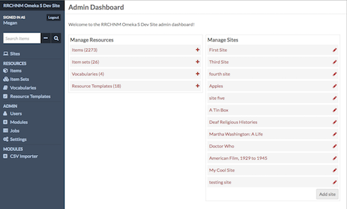
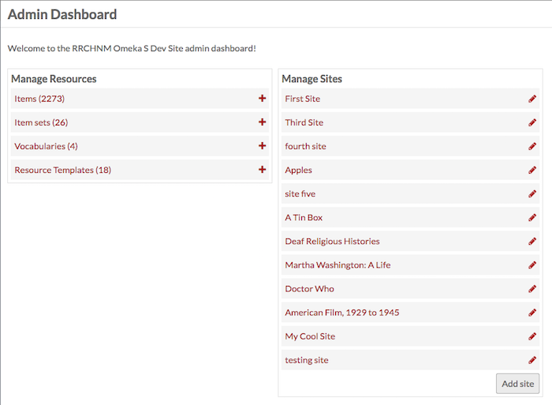
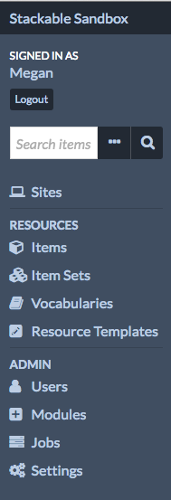
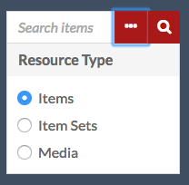

The administrative dashboard manages the content shared by all OmekaS sites and the core functionalities of the OmekaS installation. 

Admin Main Page
---------------------
When a user logs in, the first page they see is the Admin Dashboard. 

In addition to the left-hand navigation present on all pages (see below), the admin dashboard presents users with two boxes: Manage Resources and Manage Sites.

The *Manage Resources* box displays the following resources with their total count: [Items](content/items.md), [Item Sets](content/item-sets.md), [Vocabularies](content/vocabularies.md), and [Resource Templates](content/resource-template.md). Clicking on the label of the Resource will take you to the browse page; clicking the Plus button to the right of the label will take you to the add page for that resource type. 

The *Manage Sites* box lists the [Sites](sites/sites.md) on the install. Clicking on the site name will take you to the public view of the site; clicking the edit (pencil) button will take you to the Edit Site Info page for that site. 

Left-hand navigation
---------------------

The following content appears on the left side of the admin dashboard and on all administrative pages. 

In the upper left corner of the screen is a link displaying the title of the installation which will always take you back to the admin dashboard. 

Directly below the installation title is the message “Signed in as *User*” where *User* is the display name of the person logged in. Near the username (below or to the right, depending on window width) is the button to *Logout*. 

Underneath the user information is a search field which has an option for advanced search (ellipses) in addition to the button to search (magnifying glass). Use this to search all items in the installation. 

Advanced search options (the ellipses) allow you to refine the search by Res[(ource Type, limiting it to *Items*, *Item Sets*, or *Media* by clicking the radio button next to the Resource Type you want to search. 

The left hand navigation of the dashboard is divided into sections related to function and user access:

- [Sites](sites/sites.md): lists and provides access to all of the sites on the OmekaS install. (Computer icon)
- Resources: content creation and metadata management
    - [Items](content/items.md): manage the individual resources of your install. (Box icon)
    - [Item Sets](content/item-sets.md): manage aggregated groups of items. (Multiple boxes icon)
    - [Vocabularies](content/vocabularies.md): manage the metadata standards for your install. (Closed book icon)
    - [Resource Templates](content/resource-template.md): manage predefined sets of properties (fields) to use when creating items. (Pencil in a square icon)
- Admin: installation-level administration (note that some of these tabs may not be visible to all user levels)
    - [Users](users.md): manage users for the whole install and individual sites. (head and shoulders person icon)
    - [Modules](modules/index.md): add functionality to your sites. (Plus sign in square icon)
    - [Jobs](jobs.md): displays the user-activated tasks which are currently running. NB: jobs only display when they are running. (Three bars icon)
    - [Settings](settings.md): manage the global settings for all sites, the admin dashboard and the site dashboards. (Gears icon)

If you have installed modules, they may appear in the admin section of the left navigation below settings.

Note that users with more limited permissions will see only some of these navigation options.

System Information
-------------------------------

In the bottom right corner is a short display of the current version of Omeka S. Click the link labelled *System Information* to see a full page with details.

