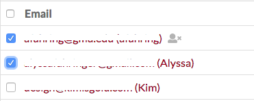
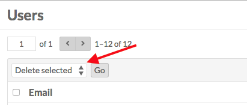
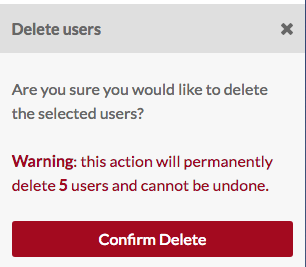

Only site and global administrators can create, edit, and delete users. Editors, Reviewers, Authors, and Researchers can edit their own user information but cannot change the information of other users. 

Administrators manage and create users from the User tab of the main administrative dashboard (head and shoulders icon). 

This Users section displays the user’s email followed by full name in parentheses, as well as their role and the date the account was created.

There are six user roles in Omeka S:

- Global Admin: full installation privileges
- Site Administrator: robust site and content privileges
- Editor (Content Expert): full privileges for content creation
- Reviewer: robust content privileges but can only delete own content.
- Author: Create own content.
- Researcher: Search and read privileges only.

## Create a New User
To create a new user, select the *Add new user* button in the upper right hand corner of the Users section in the main administrative dashboard. 

On the Add User page, enter the following:

- *Name* (full name or credit name)
- *Email address*
- Select a *Role* using the dropdown menu (see above for user role privileges)
- Check the *Is Active* box to confirm that the user is active.

## Managing Users
To manage an existing user, go to the Users section.

To view the name, email, and role of a user, click on the username. 

To see the items and item sets owned by a user, click the *more* (ellipses) button located between the *delete* (trash can) button and the user role label. This will open a drawer on the right side of the screen with this information; you can click on the number of items or item sets to go to the items or item sets created by that user.

## Edit User

To edit a user’s information, change their password, or access API keys, go to the Users section. Find the user on the table and click the edit icon (pencil) on their row in the table.

 

The Edit User page has four tabs: *User Information*, *User Settings*, *Password*, and *API Keys*. After making changes on any of these tabs, be sure to click the save button in the upper right hand corner of the browser window. At any time you may cancel your edits by clicking the cancel button next to the save button.

### User information
On this tab, you can edit the display *Name* and *Email* for the user, select or change the user *Role* and click the checkbox to confirm that the user *Is Active* (or uncheck the checkbox to render the user inactive)

### User settings
This tab allows a user or global admin to set the following:

- *Locale*: select from a dropdown of available languages. This will change the language in which the installation's admin site displays for that user.
- *Default resource template*: select from existing templates to have a template auto-load whenever the user creates a new item.

### Password
On this tab, create a new password. It must be entered twice, in both the *new password* and *confirm new password* fields to take.

To see the password requirements, click the arrow next to the New Password field. This will display a list of [requirements](../configuration) if any have been configured.

### API Key
Use this tab to generate an API key for the user. You must provide a label for the key - this could be a date or the purpose of the key. Click save to generate the key.

To remove existing API keys, check the *Delete?* box on the row for that key and click save.

## Batch edit users

You can edit multiple users at one time by using the checkboxes to the left of each user's email in the User table.

Click the checkboxes to select the users you want to edit.

Then, using the dropdown just above the table, select from the following options:

- Edit selected (users)
- Edit all (users)
- Delete selected (users)
- Delete all (users)

To edit only the users whose checkboxes you have ticked, choose "Edit selected" from the dropdown and then click "Go". You will be directed to the Batch Edit Users page.

On the right hand side of the page are the emails for the users you are editing and to whom any changes you make will be applied. 

On this page you can:

- Set role: select from a dropdown of all roles (see below) to change the role for all selected users.
- Set activity: set selected users as active, not active, or no change.
- Remove from site permissions: select from a dropdown menu of the sites on the Omeka S install, or use the option "all sites" to remove the selected users from all sites.
- Add to site permissions: select from a dropdown menu of the sites on the Omeka S install, or use the option "all sites" to add the selected users to all sites.
- Add to site permission as: a dropdown with options for viewer, editor, or admin - select which role the users will have on the sites to which you have added them. 

Once you are done, click save changes.

If you choose "Edit all" rather than "edit selected" you can apply changes to all users - excluding yourself - on the Omeka S installation. Use this feature carefully!

## Delete a User
On the User page of the administrative dashboard, click the trash can icon in the user’s row, to the left of their role information, to delete the user. Confirm the deletion in the dialog box which will appear on the right of the screen.

### Batch delete users
To delete a number of users at once, click the checkboxes next to their names on the Users table (see Batch edit users, above). 

From the dropdown menu just above the email column, select "delete selected" and click Go.

This will open a drawer on the right side of the screen with a message telling you the number of users you are about to delete. This action *cannot be undone.* To permanently delete these users, click the red Confirm Delete button. To cancel, click the x in the upper right corner of the drawer. 

The "delete all" action in the dropdown will delete all users excluding yourself. This action *cannot be undone* and should be used with extreme caution. 

To permanently delete these users, you must check the "Are you sure" box before clicking the "Confirm Delete" button. To cancel, click the x in the upper right corner of the drawer. 

## Roles and Permissions
The following is a detailed breakdown of permissions for each user role:

**Global Admin**

- Full privileges (create, edit, delete) of item, item sets, media, resource templates, site pages, sites, and users.
- Full privileges for modules - install, activate, configure.
- Search, read, create, and delete privileges for Vocabularies

**Site Administrator**

- Full privileges (create, edit, delete) of item, item sets, media, resource templates, site pages, sites, and users.
- Browse-only privileges for modules in the module tab. Site administrators can interact with active modules where appropriate.
- Search, read, and create privileges for Vocabularies (cannot delete)

**Editor**

- Full privileges (create, edit, delete) of item, item sets, media, resource templates, and site pages
- Can search, read, and create sites and users, and edit or delete sites they own. Can only delete their own user profile.
- Search and read only privileges for vocabularies.
- No privileges for modules

**Reviewer**

- Can search, read, create, and edit all items, item sets, media, sites and site pages. Can only delete those items, item sets, media, sites and site pages which the user owns.
- Search and read only privileges for vocabularies and resource templates.
- No privileges for modules

**Author**

- Can search, read, and create items, item sets, media, and site pages. Can only edit or delete content which the user has created.
- Search and read only privileges for vocabularies and sites.
- No privileges for modules

**Researcher**

- Search and read-only privileges for all content, sites, and users. 
- No privileges for modules
