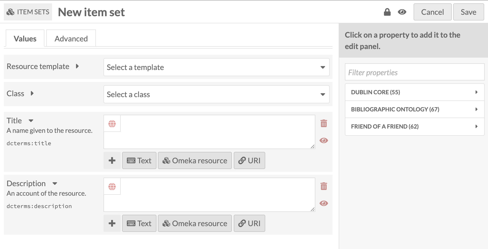
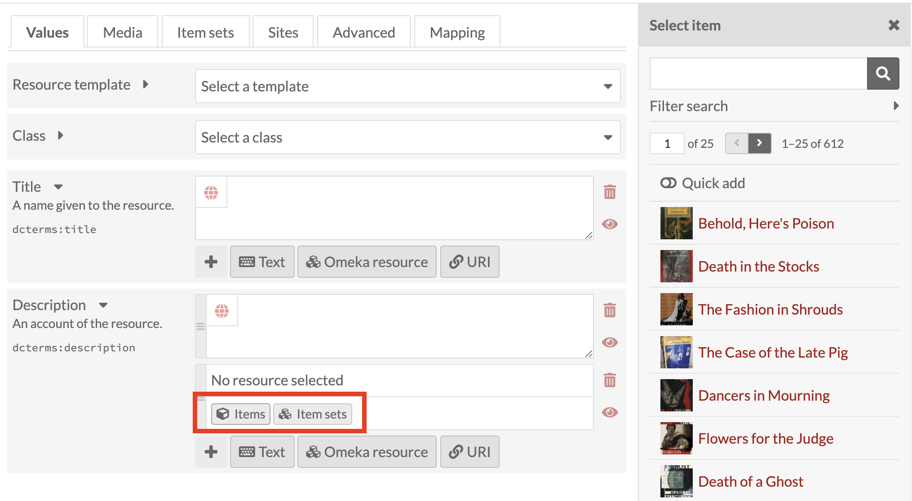
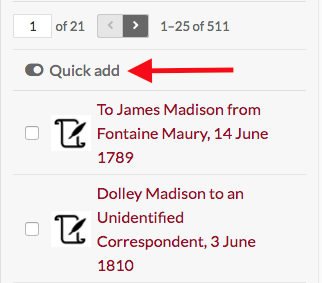
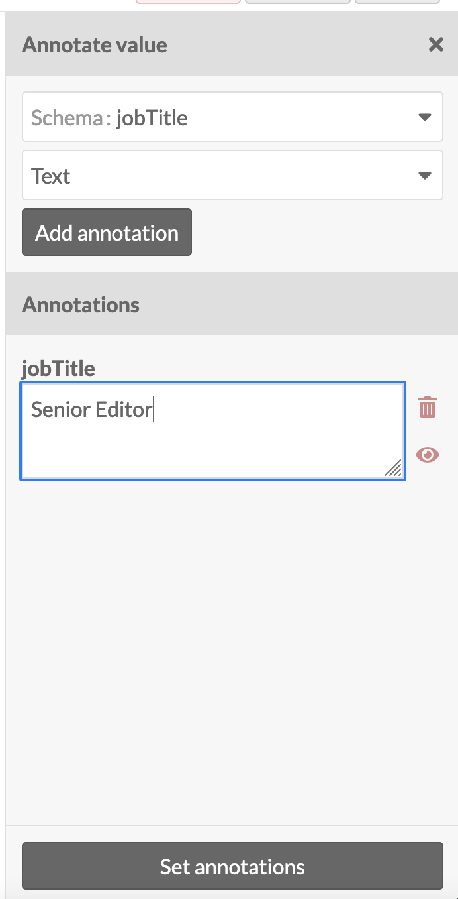
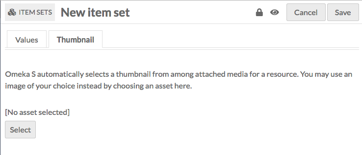
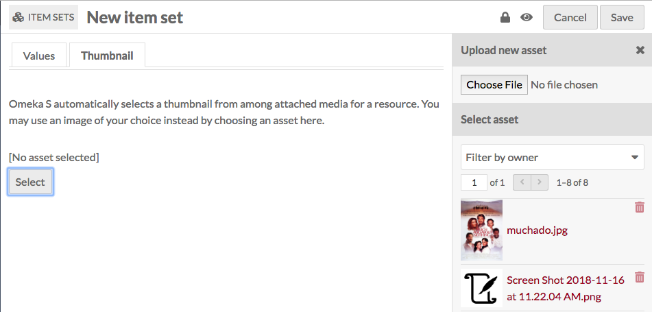
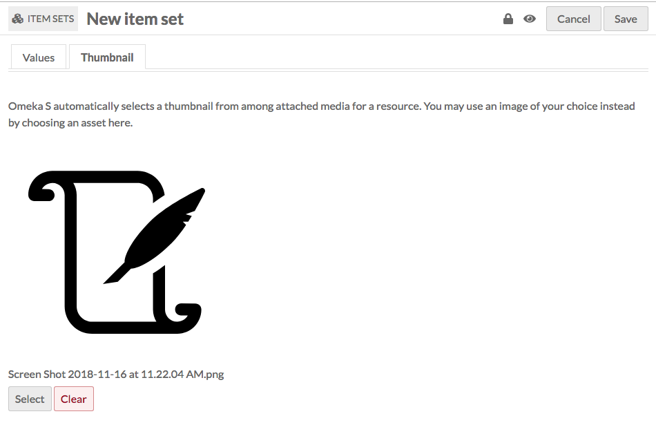
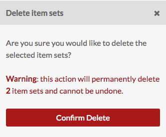
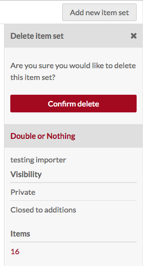
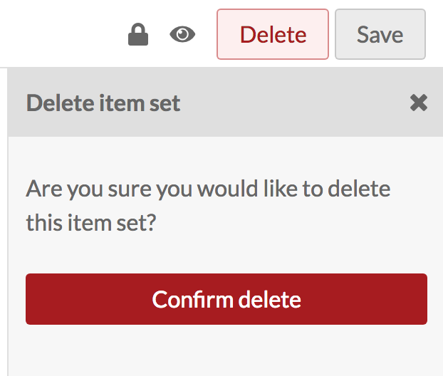

# Item Sets

Item sets are an aggregation of *items*, similar to collections in previous versions of Omeka. In Omeka S, items may belong to any number of sets, and an item set can have any number of items.

Item sets are managed via the *Item Sets* tab (stacked boxes) located in the left navigation of the admin dashboard. 

After clicking on the tab, a table appears listing all item sets with: 

- their *Title*; 
- icons for each row representing options to *edit* (pencil), *delete* (trash can), or *view details* (ellipses); 
- the item set’s *Class*, 
- the *Owner* of the set, 
- and the date the set was *Created*.

Above this table on the left is the pagination for the item sets table, where you can click the left and right arrows to move forward and back or enter a page number to go a specific page of item sets. 

In the center above the table is the button for *advanced search*. 

On the right above the table are drop-down menus to re-order the table by *title, class, owner,* or *date created* in either *ascending* or *descending* order. 

In the upper right corner is the button to *Add new item set*. 

## View Item Set

To quickly see information about an item set, click on the *view details* button (ellipses) for the item set on the item sets browse page. This will open a drawer on the right hand side of the page with the item set’s Title, Visibility, and number of Items.

To view all the information for an item set, click on its name. On the item sets view page, there are tabs to see an item set’s *Metadata* and *Linked Resources*. On the right side of the item set’s view page is information about the date created, owner, and visibility. For item sets, visibility includes both whether the set is private or public and whether other users can add items to the set. 

The item set’s *metadata* is entered by users. 

*Linked resources* are items which have used the item set to populate specific metadata properties. When viewing linked resources, the table includes the predicate (property or description) and the object (linked item resource). Note that incoming resources (those used as properties for the item set being viewed) will *not* display here, as they already display in the item set's metadata.

To view the items in a set, either click on the number of items in the set on the item set browse page, or click the *view items* button in the upper right corner of the individual item set page.

## Add an item set

To add a new item set, click the Item Sets tab from the left navigation of the dashboard. Click the *add new item set* button on the right hand side of the screen.

Item sets may use the same resource templates available for items to provide pre-selected fields. Each set should contain at least one descriptive value, such as Dublin Core Description. 

You may add other fields by selecting a property from the list on the right. Browse fields by vocabulary (Dublin Core, Bibliographic Ontology, etc), or search in the *filter properties* bar above the list of properties and vocabularies.

### Values tab
You may add text, a resource from the installation, or an external link in each field.  

By default, a new Item Set will load with the properties dcterms:Title and dcterms:description. You may add other fields by selecting a property from the list on the right. Browse fields by vocabulary (Dublin Core, Bibliographic Ontology, etc), or search in the *filter properties* bar above the list of properties and vocabularies.

You can set individual properties as Private or Publicly visible using the eye icon for each property. Note that properties set to private are still visible to Global Admins, Site Admins, and Editors will be able to see properties even when set to private. Authors will be able to see all properties on items they own, but will not see private properties created by other users.

In the image below, the first property (Title) is public as indicated by the open eye icon. The second property (Description) is private as indicated by the slashed-through eye icon. Clicking or hitting enter on the eye icon toggles between public and private. 

 
### Text
Text fields are entered with text. The keyboard at the top of the field input indicates text. You can indicate the language for the content of an input using the globe symbol above the input (see the red arrow in the image below). Click on the globe to activate a text field, then enter the [ISO 639-1](https://en.wikipedia.org/wiki/List_of_ISO_639-1_codes) code for the language in which the text is written.

### Omeka Resource
These fields create an internal link between the resource you are creating and the resource which fills that field. You have the option to use either another item or an item set. Once you select an item or item set, detailed information will load, and you must click *select resource* to finish linking the resources. You can also click the *X* button in the upper right-hand corner to go back to the list of items or item sets.

When creating an item set, you have the option to use either another item or an item set. 

Choosing a resource type will open a side drawer where you can browse all of those resources in the installation. You can use the search function at the top of the drawer to narrow down the list or to quickly find a specific item or item set 

Once you select an item or item set, detailed information will load, and you must click *select resource* to finish linking the resources. You can also click the *X* button in the upper right-hand corner to go back to the list of items or item sets.

If you are using an Item resource for the property, you will have additional options for finding the item you want in the drawer. Open these options by clicking the triangle button next to the phrase "Filter search"

This will open a menu below the button with the following options to filter the items in the drawer:

- Filter by class: a dropdown where you can select any class provided by the vocabularies on the installation;
- Filter by item set: a dropdown where you can limit the items displayed in the drawer to only those associated with a particular item set
- Filter by item ID: a search field where you can input the ID of the item you want to use. You can find an item's ID in the url of it's edit page; if you are editing the item and the url is `admin/item/11547/edit` then the item's ID is 11547.

Item resources also have an option for "Quick add". When this switch is flipped, all of the items in the drawer have a checkbox. You can use these checkboxes to add multiple items as a property at once. Note that you can only edit one property at a time, so all of the items must populate the same property (ex, Creator, Has Part). 

#### URI
URI fields link to an external website or online resource.

You may add other fields by selecting a property from the list on the right. Browse fields by vocabulary (Dublin Core, Bibliographic Ontology, etc), or search in the *filter properties* bar above the list of properties and vocabularies.

#### Value annotation
When you input a value for a property associated for a resource, you are making a statement about that resource. If you choose, Omeka allows you to make statements about that statement. We call this value annotation. The advantage of value annotation is that you can choose to make ambiguous facts more concrete by annotating things like:

- Provenance: Where is this fact from?
- Time: When did this fact occur?
- Location: What is the location associated with this fact?
- Certainty: What is the confidence of this fact?
- Type: What type of concept/thing is this fact?

In the world of linked data, this process is know as [reification](https://www.w3.org/wiki/RdfReification). Each value can have any number of annotations.

To create an annotation, click on the ellipses on the right side of the value input interface, and then click on the annotation icon (a dialogue bubble). 

The annotation sidebar will open to the right. Select any property that is available within the Omeka S installation to describe the relationship between the annotation and the value it describes. For instance, the value for associated with the property DCterms:Contributor might be annotated with the property Schema:jobTitle. 

Then select a date type for the annotation: Text, URI, or and Omeka S Resource. Installed modules may make additional data types available. Click the Add Annotation button. 

Input the annotation, and click Set Annotations to finalize the process. 

Sitess include a setting to indicate whether or not value annotations are visible to the public. 

### Advanced tab
By default, Omeka S will use the media from the first item added to an item set to generate a thumbnail for the set. If you want to use a non-media image for the thumbnail for an item set you can set it here.

The assets you select from and upload as thumbnails in this tab are the same as those created for [site logos](../../sites/site_theme/#settings-options). 

To assign an asset as a thumbnail, click on the Select button in the main work area of the tab. This will open a drawer on the right side. 

The drawer offers two options: upload a file using your browser, or select from existing assets. To select an existing asset, simply click on it and it will automatically be assigned to the item set. 

To remove an asset which you have assigned as a thumbnail, click the "Clear" button below the image of the asset. To replace it, click select and either choose or upload a new thumbnail asset.

### Access Settings
Item sets have two settings which control their access. They can be *public* or *not public* and they can be *open* or *closed*.

Use the *make public/private* button (eye icon) to make the item set visible to the public or only to all users of the Omeka S installation (not public). 

*Open* sets can be edited and added to by any user on the install.

*Closed* sets are available and editable only by its creator, site admins, and global admins.

 Open and Public 

  Closed and Private

Note that the public/private and open/closed settings operate independently - you can have an open and private item set, for example.

## Edit an item set
Once you have created an item set, you can edit it at any time, either by clicking the edit icon (pencil button) or clicking on the item set's title and then clicking the Edit button in the upper right-hand corner of the screen.

Options for editing an item set are the same as for creating an item set. 

To cancel out of editing, click the Cancel button in the upper right corner, between the Delete and Save buttons. 

## Batch Editing

From the browse page of item sets (admin/item-set) you can batch edit item sets, using the dropdown menu on the upper right near the "Add new item set" button. You can select multiple item sets using the checkboxes on the left of each set's row.

Batch actions are as follows:  

- Edit selected: edit only the item sets that are selected on the page
- Edit all: edit all the item sets returned by a search (default is all item sets)
- Delete selected: delete only the item sets that are selected on the page
- Delete all: delete all the item sets returned by a search (default is all item sets)

Choose one of these options and then click *Go*.

**Batch editing** item sets takes you to a new page. The item sets being edited will display on the right side in a drawer, while the batch edit form gives you the following options:  

- set visibility: a dropdown, select from public or not public.
- set openness: a dropdown, select from open or not open.
- set template: a dropdown, select from the installation's resource templates.
- set class: a dropdown, select from classes of the installed vocabularies.
- clear property values: a dropdown menu with all the properties in all vocabularies, selecting from this will remove any values in that property in the affected item sets. Clear additional properties using the *Clear another property* button.

In addition,  you can use the bottoms at the bottom of the batch edit form to add properties to every item set:

- add text value
- add resource value
- add URI value  

Selecting any of these will add a block to the form where you can select a property from the installed vocabularies and enter the value for that property.

For the **delete actions**, a drawer will open on the right side of the screen telling you the number of item sets which will be deleted. Nothing will be deleted unless you click the red *Confirm Delete* button. This action cannot be undone. To opt out of deleting the item sets, click the X in the upper right corner of the deletion drawer. To confirm delete, check the "Are you sure" checkbox and then click *Confirm Delete*. Note that deleting the item set will not delete the items associated with that set.

## Delete Item Set
In addition to the batch delete function described above, you can also delete individual item sets. 

Note that deleting item sets does not delete any items associated with the item set. 

From the Item Set browse view, you can delete an item set by clicking the trash can icon in the row for the item set you want to delete. This will open a drawer on the right with a message at the top asking you to confirm that you want to delete the item set, with the metadata for the item set below the confirm delete button. Click *Confirm delete* to delete the item set, or close the drawer to cancel.

From the edit page for an Item Set, click the *Delete* button in the upper right-hand corner. This will open a drawer on the right side asking you to confirm that you want to delete the item set. Click *Confirm delete* to delete the item set, or close the drawer to cancel.

