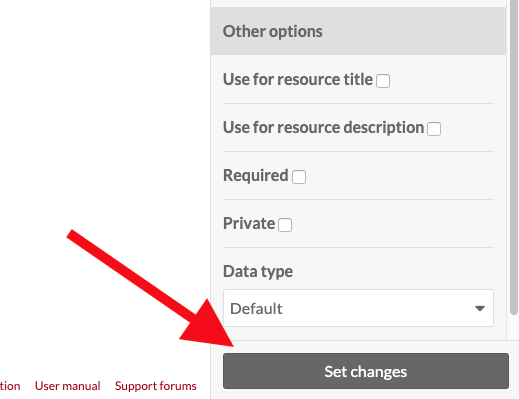
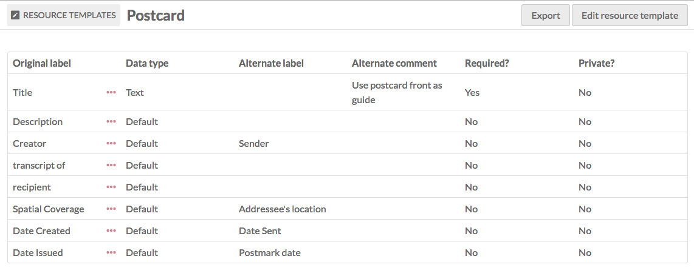
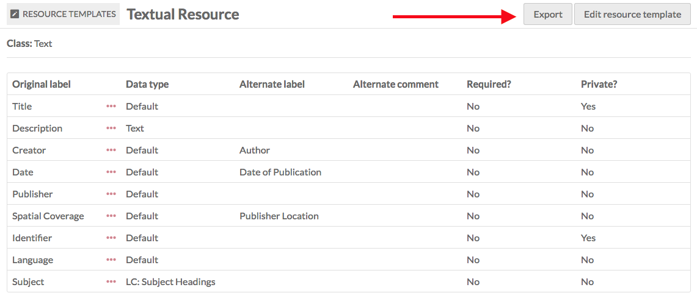

A *Resource Template* is a set of pre-defined Properties, optionally with a Class, to guide Item creation and the interpretation of Properties. 

Resource templates are managed from the Admin Dashboard, accessed through the left-hand navigation under the tab labeled *Resource Templates*. 

On the left side above the table is a display for the number of pages of items, with forward and back arrows. The current page number is an editable field - enter any valid page number and hit return/enter on your keyboard to go to that page.

On the right side above the table are two drop-down menus which let you sort resource templates. You can sort by: *label*, *class*, *owner*, or number of *items* assigned to a template, and have these display in either ascending or descending order. 

You can use the icons in each template’s row to: *edit* (pencil), *delete* (trash can), or *view details* (ellipses). If you click on the number of items listed for a template, it will take you to a list of all those items. 

[This screencast](https://vimeo.com/290924872) gives an overview of using and creating Resource Templates.

[This screencast](https://vimeo.com/290924872) gives an overview of creating and applying resource templates. 

## Base Resource
All Omeka S installations include a Base Resource template which maps to the metadata fields required by the Digital Public Library of America (DPLA). It will display in the table of resource templates as "Base Resource" with no owner. 

The Base Resource template contains the following Dublin Core fields: Title; Rights; Type; Creator; Date; Description; Format; Language; Spatial Coverage (Place); Publisher; Alternative Title: Contributor; Extent; Identifier; Relation; Is Replaced By; Replaces; RightsHolder; Subject; Temporal Coverage.

## Create a resource template
From the Resource Templates tab in the Admin Dashboard, click the *Add new resource template* button.

The New resource template page will load with options for Label, suggested class, and the properties *Title* (dcterms:title) and *Description* (dcterms:description)

1. In the Label property, type the label for your new template. This will be the text displayed in the dropdown for Resource Templates when creating an item, so be sure that the label is clear.
1. If desired, select a class to associate with the template.
1. Add properties from the list of vocabularies in the menu on the right side of the screen. You can filter properties in the text box or select from a specific vocabulary using the arrows to the right of the vocabulary names. 
1. If desired, modify the property (see Property options, below)

Be sure to Save your resource template before leaving this page.

### Property options
You can modify the display label, comment on the label, set a property as required, and set the default data type for each property in your template.

To do this, click the edit (pencil) icon in the row for the property you wish to modify. This will open a drawer on the right side of the screen with the ability to edit the properties.

**Label**  
Change the displayed label of the property that appears when the template is applied to an item by entering the text you want to appear in the *Alternate Label* field for each property.

**Comment**  
Add alternate comments for the property in the field *Alternate* in this section. This will change the text under the property name when users are creating items using your Resource Template.
 
**Other options** 
In this section are a series of additional options for modifying the property when it is used with this template.

The *Use for resource title* checkbox allows you to select a property to serve as the title for the resource, instead of the default (`dcterms:title`). This property will display in the "title" field on browse pages.

The *Use for resource description* checkbox allows you to select a property to serve as the description for the resource on browse pages, instead of the default (`dcterms:description`). 

The *Required* checkbox sets whether a property is required when the template is in use. If checked, users will not be able to save an item or item set using this template without adding data for this property.

The *Private* checkbox sets the visibility of the data for this property. If checked, any data added by a user for this property will only be visible to the owner of the item or item set, global administrators, site administrators, and editors. It will not be visible to the public. *Note:* users working with the template will be able to toggle the visibility of this property on a case-by-case basis.

Using the *Data type* dropdown, you can designate the data types for the property. Whichever you choose will be automatically loaded once someone selects that Resource Type and they will only be able to use these data type for the element when using this Resource Template. 

  - Literal: text and/or html input
  - URI: a link with label.
  - Resource: either an existing Item or Item Set in the Omeka S install.
  - Additional options may be added by modules, such as [Numeric Data Types](../modules/numericdatatypes) and [Value Suggest](../modules/valuesuggest).

You can select multiple data types, for example giving users the option of Literal or Resource for input, but not URI. All choices will appear in the data types field with an X to the right of their label - click the X to remove that data type. 

Note: you must click the *Set Changes* at the bottom of the drawer for each property that you edit before exiting the drawer or moving on to another property! If you do not click *Set Changes*, your edits will not be saved.

Users who select this resource template when creating an item will still be able to add other properties to the item, and that they will only be required to fill out those which you check as required.

## Edit a resource template
Once you have created a resource template, you can edit it at any time by clicking the edit icon in the table of resource templates, or by clicking Edit in the upper right hand corner when viewing a resource template.

If you decide you do not want to edit the template or do not wish to save your changes, simply click the Cancel button located between the Delete and Save buttons in the upper right hand corner of the window.

## Reviewing resource templates
Clicking on the title of a resource template takes you to a table view of all the properties and property options for that template.

Each property displays as a row in the table, with columns for:

- Original label, with an ellipses button to see which the property's vocabulary, term, and original comment;
- Data type;
- Alternate label;
- Alternate comment;
- Whether the property is required;
- Whether the property's data is set to private.

Click the ellipses next to the original label to open a draw displaying the property's vocabulary, term, and original comment.

Use the buttons in the upper right of this page to export or edit the template.

## Sharing Resource Template
It is possible to share a resource template between Omeka S installations by exporting and importing them.

### Export Resource Template
To export a resource template from your Omeka S installation:

1. Go to the Resource Templates menu on the main navigation.
2. Click the Label of the template you want to export.
3. On the resource template view page, click the Export button in the upper right corner of the screen.

[^]

Exporting a Resource Template will download it to your computer's default download location as a json file with the same name as the Resource Template's Label.

### Import Resource Template
To import a resource template (exported from a different S installation) into your Omeka S installation:  

- Go to the Resource Templates menu on the main navigation
- Click the Import button in the upper right corner of the screen.

- On the Resource Template: Import page, click the *Choose File* button
	- This will open your browsers file selection window. Choose the json file for the resource template you want to import
- Click the Review import button
	- On the Review page, you will be able to check that properties and property options are correct
	- Imported templates which used Value Suggest or Custom Vocab will indicate in the Data Type column what the original source was, and a dropdown to allow you to select a new Data Type (if you do not have the necessary modules, the dropdown will only show the default options).

NB: If you want to import a Resource Template using a Custom Vocab, you will need to manually reproduce the Custom Vocab on the second Omeka S installation *before* importing the resource template.
