Mapping is a [module](../modules/index.md) for Omeka S which allows you to geolocate Omeka S items and add interactive maps to [Site Pages](../sites/site_pages)

To install Mapping, follow the instructions for [Installing Modules](../modules/index.md#installing-modules) on the Modules documentation.

Mapping is compatible with [CSV Import](../modules/csvimport.md). 

## Item Mapping

To add a map to a new or existing item, click to edit the item. Navigate to the  _Mapping_ tab to add a map to the item. Selecting the tab will open the map interface.

### Manipulating the Map
Small white buttons on the left side of the map control and modify the appearance of the map. Hover over the buttons with the mouse to view tool-tips.

 

* **Zoom in**: The small white square with a black plus sign. Each click zooms in one step.
* **Zoom out**: The small white square with black minus sign. Each click zooms out one step.
* **Draw a Marker**: The small white square with black bubble marker. When you click the button your pointer becomes a blue marker. Click again on the map to place the marker. An item can have multiple markers on its map. _(See Figure 1 below.)_
* **Move Marker**: The small white square with black box and pencil icon. This option is only available after a marker has been added. Click the button and a pink box appears around each marker. Click a marker to move it. Click again to place. Use the grey buttons to _Save_ or _Cancel_. _(See Figure 2 below.)_
* **Delete Marker**: The small white button with a trashcan icon. This option is only available after a marker has been added. Click the icon to select a marker. Click the marker to be removed and it will disappear. Use the grey buttons to _Save_ or _Cancel_ these changes. _(See Figure 3 below.)_
* **Search Address**: The small white square with a black magnifying glass icon. Click to enter an address in the search bar. Hit enter to locate. _(See Figure 4 below.)_
* **Set the current view as default view**: The small white square with a target or crosshair symbol. The map will default to a zoomed out (global) view. Click to set the current view as the default view.
* **Go to current default view**: The small black square with a black box around a dot. The This option is only available after you have set a default view. Click to pan and zoom map to the selected view.
* **Clear the default center and zoom level**: The small white square with a black "X". This option is only available after you have set a default view. Click to clear pan and zoom preferences and return to the initial global view.

In addition to these options, you can also navigate the map using your mouse or trackpad by scrolling to zoom and clicking and dragging to pan.

### Adding locations to an item

In order to add a location to an item, go to the Mapping tab.

To find the point where you want to locate the marker, you can do one of the following: 

* Zoom and drag to find the location.
* Type the place name into the Search Address field (see Figure 4 below). 
	* Note that this will populate as you type, and will not search locations which do not match the formatting of the search function.
* Enter latitude and longitude coordinates into the search box. These should be formatted as decimals, for example `38.897222, -77.064167`, not `38° 53′ 50″ N, 77° 3′ 51″ W`

Click on the *Draw a Marker* tool in the right hand toolbar. Your cursor will become a marker which can move around the map. To set the point, click on the map.

You can now click on the marker to add a label which will display on public map views of the item.

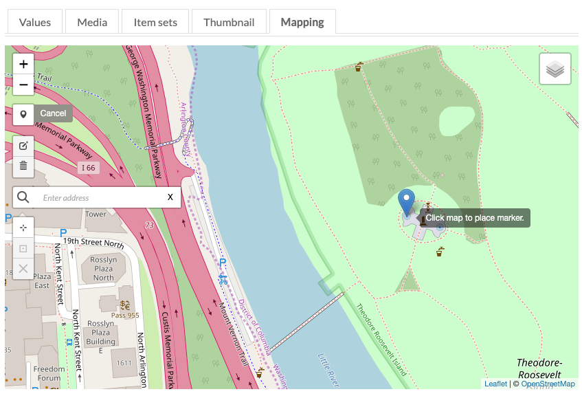

*Figure 1*: Drawing a Marker:
Draw a marker - the lower marker in the image is the cursor placing a location.
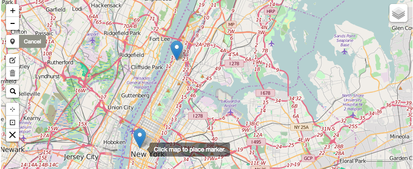

*Figure 2*: Move a Marker
The lower marker is in the process of being moved. 
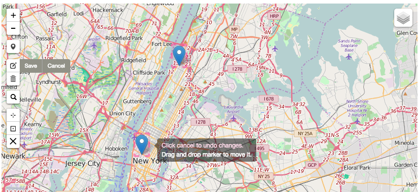

*Figure 3*: Delete a Marker
Select an existing marker then click the trash can icon to delete the marker.
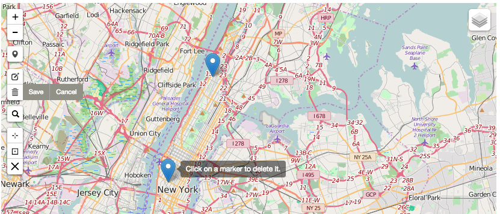

4. Search Address
Click the magnifying glass icon to open a search address field.
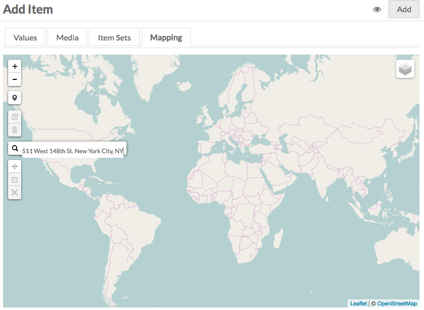

### Modifying the appearance of a Marker
The appearance of existing markers may be modified. Click the Marker to open a dialog window.

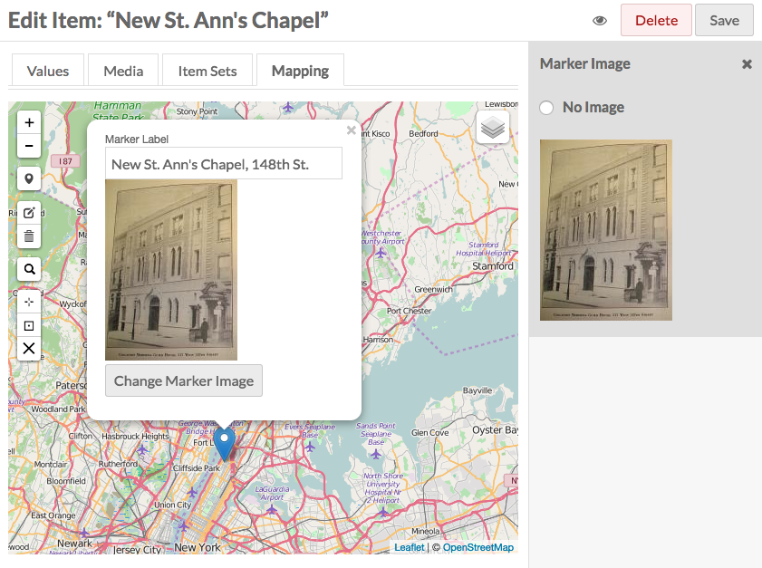

* Enter descriptive text in the text field. 
* To add an image to the marker click _Select Marker Image_ to select an image from the media uploaded to this item. 
	* Note: the item must have image media attached in order to select an image. 

## Adding a Map block to a site
To add a map to a new or existing page, click to edit the page. On the right, under _Add New Block_ , click the  _Map_ tab to add a map to the item (1). Selecting the tab will open the map block to the page (2). This block includes customizable features for the map in collapsable panes. Click the triangle to expand or collapse these fields (3). 

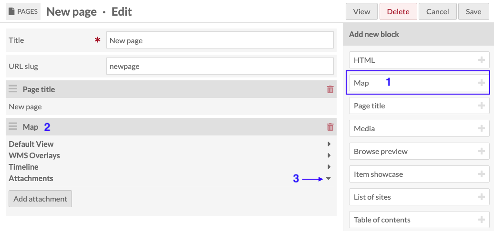

### Default View 
 Small white buttons on the left of the map interface set the default view for the map: 
 
 * *Zoom in:* The small white square with a black plus sign. Each click zooms in one step.
 * *Zoom out:* The small white square with black minus sign. Each click zooms out one step.
 * *Set the current view as default view:* The small white square with a target or crosshair symbol. The map will default to a global view. Click to set the current view as the default view.
 * *Go to current default view:* The small black square with a black box around a dot. This option is only available after a default view has been set. Click to pan and zoom map to the selected view.
 * *Clear the default center and zoom level:* The small white square with a black "X". Click to clear pan and zoom preferences and return to the initial global view.

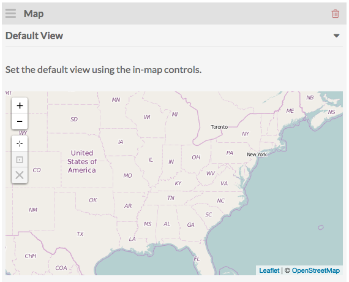

### WMS Overlays

 Add, edit, and delete [Web Map Service (WMS)](https://mapserver.org/ogc/wms_server.html) overlays.
 
 * *Label:* Create a unique, descriptive label for the map overlay. This will be visible to visitors and should be used to differentiate between overlays. 
 * *Base URL:* Add a URL to the WMS map.
 * *Layers:* Any layers you wish to use, separated by commas.
 * *Styles:* Any styles you wish to use, separated by commas.
 
 Click Add Overlay to create the overlay. Click _Clear Inputs_ to clear each of the fields. Multiple overlays can be added.
 
 

  Once you have added an overlay, it will appear above the fields for adding overlays. 
 
  Choose a default overlay by checking the box next to it. Edit an overlay by clicking on on the red pencil edit button, or click the red trashcan icon to delete the overlay.
  
  
 
### Timeline
Timeline adds a timeline display to the left of the map view. Note that this feature requires the [NumericDataTypes](../modules/numericdatatypes/) module and at least one item that has a property with a Timestamp or Interval value (applied via the [resource template](../../content/resource-template/)). 

- *Title headline:* displays on the first slide of the timeline (see ["Timeline public view"](../../modules/mapping/#timeline-public-view) below). You can use this to name the timeline.
- *Title text:* appears below the title headline on the first slide of the timeline (see ["Timeline public view"](../../modules/mapping/#timeline-public-view) below). You can use this to provide context or narrative introduction for the timeline.
- *Fly to:* is a dropdown menu where you can set the zoom level for each point in the timeline on the map. Your options are default view, or zoom levels 0-18 (even numbers only). The higher the number, the more zoomed in the map will be. 
	- Note that the transition between points is animated, so if you have very distant points the shift between them will involve a significant zoom out and in. 
- *Property:* a dropdown menu; select the timestamp or interval property to use when populating the timeline. The dropdown menu will populate with the properties which have been defined in a resource type as using numeric data types Interval or Timestamp. 
	- You may want to make a note of which property and numeric data type you are using before creating the map block. The dropdown only displays the term and data type but not which template it is associated with, for example `Date Created (numeric:timestamp)`.
	- Noted that you can only select *one* property per timeline. You cannot mix timestamp and interval data. 

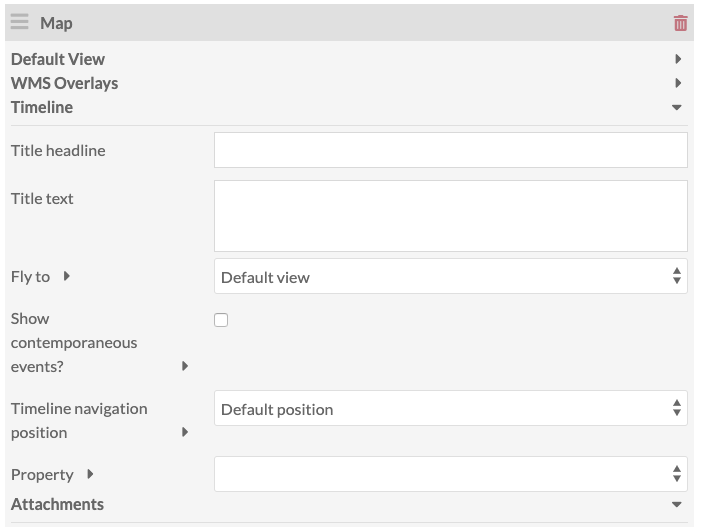

To remove the timeline from a map block, click the X on the far right of the Property dropdown.

### Attachments

Markers are added to the map using _Items_.

* Click _Add Attachment_  (1) to select them from a list on the right (2). Note: This list will only be populated by items that have at least one location added to them (when editing the item).
* Clicking an item adds it to a list in the Attachments pane (3).
* Click and drag items in this list to reorder them. 
* Delete items by clicking the red trashcan. 

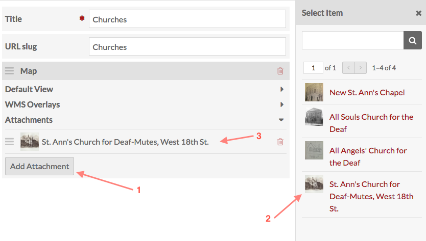

## Public view
A map block will display on a public page at full page width. If you have settings in the [default view](../../modules/mapping/#default-view) of the block, these should be applied. Otherwise the block will zoom so that all of the items are visible. 

Viewers can zoom either using the scroll function of their computer or the Zoom in/out buttons on the left side of the map.

Each item will display as a marker on the map. Markers which are close together will display as a cluster circle, with a number indicating how many items share that location. As you zoom in, these clusters may break open. 

Clicking on a marker will open a label for that marker. If you have not added a label or media for the marker, it will simply say "view item." If you have added a label, it will show the label, as well as representative media and a link to the media if the marker has one.

Item mapping marker with label only:

Item mapping marker with label and media:

Item mapping marker with no label or media: 
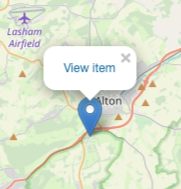

### Timeline Public view
On the public side, the timeline will display to the left of the map, or above the map on mobile views. Each item appears on both the map and the timeline.

On a map block with timeline, the block initially loads with the map either at default view or zoomed to display all markers. The timeline will display the title headline and text, as seen below:

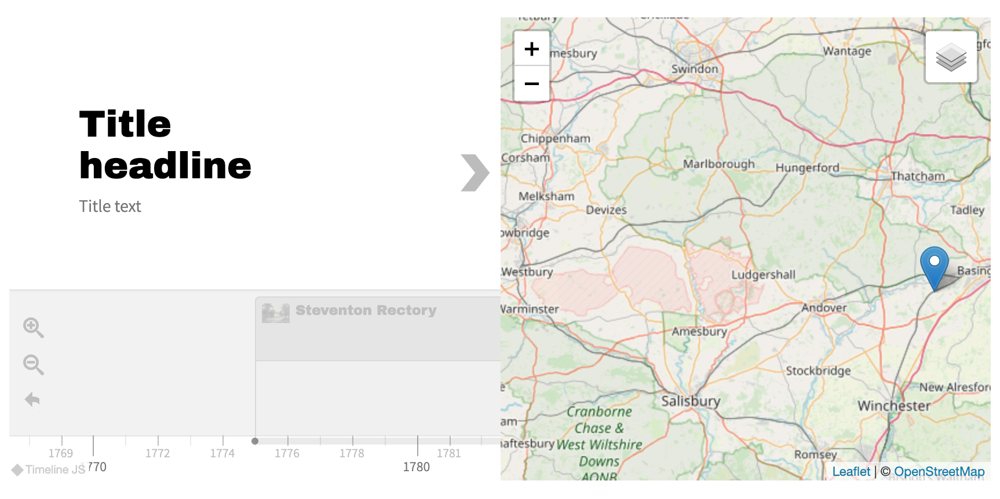

In the timeline half of the display, information appears on the top and the timeline on the bottom. The timeline viewer has zoom buttons which increase or decrease the horizontal display of time (zoom in for year by year, zoom out to see decades at once). The arrow below them returns the viewer to the title slide.

When mousing over the timeline, the cursor changes to a four-directional arrow. Viewers can hold and drag left and right to scroll through the timeline. They can also navigate between items using the semi-opaque right and left arrows on the information area of the display.

Clicking on a maker will display that item's date or interval, title, description, and attached media. The information area has a scroll bar for longer material. The title acts as a link to the item's show page.

Whenever an item is selected, its marker in the timeline will show up with a highlight to indicate that it is active.

**Numeric:Interval appearance**
Interval properties display as a long bar running horizontally across the timeline, with bars reaching down to the timeline at the start and end dates of the interval. Overlapping intervals will stack.

**Numeric:Timestamp appearance**
Timestamp properties display as a flag on the timeline, with one bar anchoring them to the timeline. Items which overlap either due to date or long text will stack.

## Troubleshooting
If you would like to remove the mapping location from an item, you must delete all the map modifications. First, click to delete each marker (click the Delete a Marker button, select the marker, click to save) and then click to clear the default center and zoom level (click the Clear the default and zoom level button. The map will return to a global view). Click to save the item and confirm that the map no longer appears.
