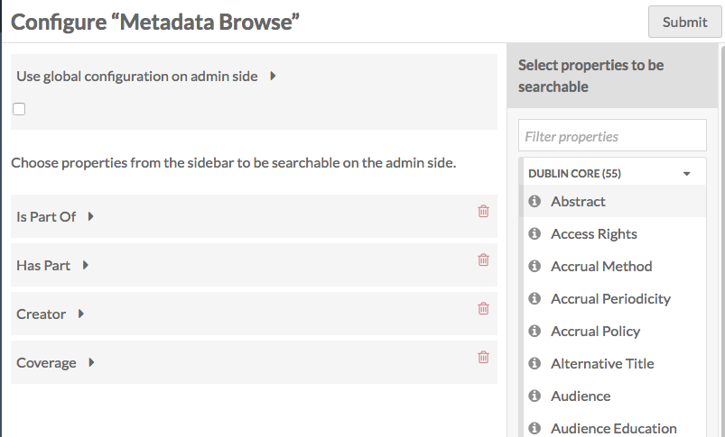
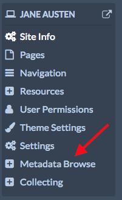
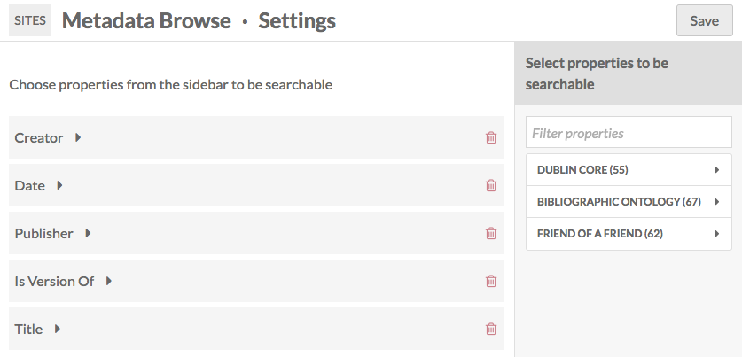
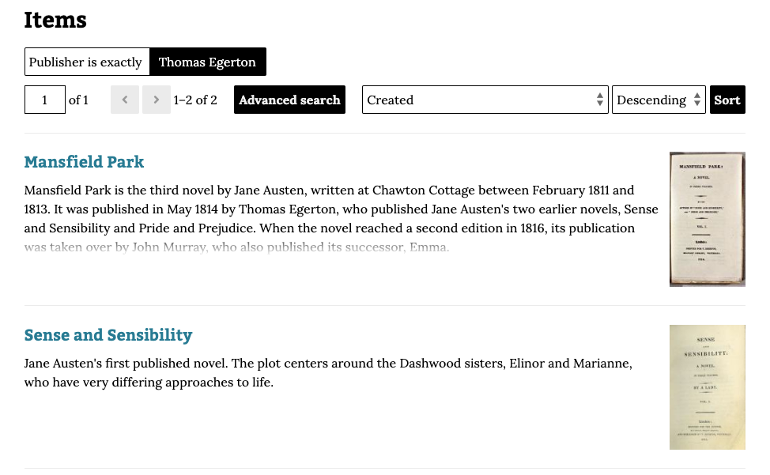

The Metadata Browse module makes it possible to browse all resources that share a value for a particular metadata property. 

It does this by adding a link below selected properties that reads "See all items with this value"; when clicked, the module returns the results of that search (property value is equal to input). In function it is similar to the Omeka Classic plugin [Search by Metadata](http://omeka.org/add-ons/plugins/search-by-metadata/). 

The module's browse function is applied on the admin side when the module is active, and can be enabled on the public side of individual sites,  on a site-by-site basis. 

## Configuration Options
Once you have installed and activated the module, you can configure it from the Modules tab of the left-hand navigation. Click the Configure button, with the wrench icon, to the right of the Metadata Browse label. 

The module has an option for global configuration settings on the admin side selecting properties to be applied on the admin side. The checkbox determines how the properties available for *admin side* metadata browsing (on items and item sets views) are determined: by aggregating the properties selected on all of the sites in the installation (unchecked) or limited to only the properties selected by a global administrator (checked).

If the box is checked, there will be additional options to select properties.

### Global Configuration checkbox
The module has one configuration setting, accessed from the Modules browse. 

The checkbox determines how the properties available for *admin side* metadata browsing (on items and item sets views) are determined: by aggregating the properties selected on all of the sites in the installation (unchecked) or limited to only the properties.

When the box is *unchecked*, metadata browse on the admin side (and only the admin side) aggregates the metadata browse settings for all individual sites and applies them to every item and item set in the installation. 

Leaving the box unchecked allows installation users to browse the properties on the admin side which they have set as key on their sites. For example, a site about various artists might have the Metadata Browse enabled for 'Creator' (Dublin Core), while a site collecting conference papers might enable Metadata Browse for 'presented at' (Bibliographic Ontology); with the box unchecked, both 'Creator' and 'presented at' would have Metadata Browse enabled on the admin views of all items and item sets on the installation.

When the box is *checked*, individual site settings still apply on the public views of those sites, but are not used on the admin side. Instead, only those properties selected in the Metadata Browse module configuration settings (the current page) are used on the admin side. So if the global admin of the installation example above checked the Global Configuration box and only enabled the properties 'Title' and 'Creator', then the 'presented at' property would not include a "See all items with this value" option on the admin side item browse.

Checking the box can be used to limit the number of properties which have Metadata Browse enabled on the admin side. If, for example, the site about various artists mentioned above was using Metadata Browse on every possible property, those Metadata Browse links would still be visible on their site, but would not show up on the admin side. Instead, the Global Administrator(s) could decided which properties to enable browsing on for the admin side, thus reducing visual clutter. 

### Choose properties
Selecting properties for Metadata Browse in the Module configuration will only work if the *use global configuration*  checkbox is checked. 

Select the properties from the sidebar by clicking on the desired property. It will load under the prompt "Choose properties".

To remove a property simply click the trash can/delete icon to the right of the property label.

## Admin side browse

Once you have selected properties for Metadata Browse, either in the configuration for the module or on at least one site, you will be able to search for exact matches to item and item set properties on the admin side.

When viewing the metadata of any item (not when editing), you will see links for "see all items with this value" on any property which has been made active in Metadata Browse. Clicking on the link will perform an exact match for any other item in the installation with that value in that property.

## Metadata Browse on Sites

Once the module is activated and installed, it will show up in the context menu for [sites](../sites/index.md) on your installation. 

To set up Metadata Browse for a site, click on the Metadata Browse tab in the site's context menu.

On the page which loads, select properties from the sidebar to enable metadata browse by clicking on them in the sidebar.

Delete any selected properties by clicking the trash can/delete icon. If you accidentally click the delete button, simply click the undo button which replaces it to keep that property. 

Remember to click the *Save* button to save changes. 

### The Public View
Once you have selected properties and saved changes, visitors to your site can use the Metadata Browse properties to search for all items on the site with matching properties.

In the example below, Metadata Browse is available for Title, Author (Creator) and Date of Publication.

Clicking on "See all items with this value" under creator takes a visitor to a page of search results where the Author is exactly "Jane Austen" - as shown in this image:

