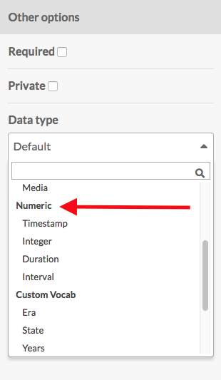
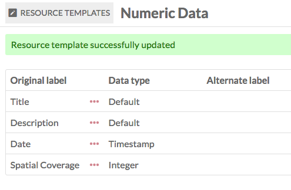

This module allows you to set certain properties as numeric data, using resource templates. You can designate properties as either date and time (ISO) or integers.

To install Numeric Data Types, follow the instructions for [Installing Modules](../modules/index.md#installing-modules) on the Modules documentation.

## Creating numeric properties
To implement the module, you will need to create or edit a [resource template](../content/resource-template.md) to set specific properties as having numeric data types. 

When creating or editing a resource template, find the property you want to set as numeric in the right hand sidebar. Click on the property to add it to the template.

Once the property has been added to the template, click the pencil/edit icon to edit the property. In the right hand drawer which opens, look for the dropdown "Data type" under the heading "Other options".

In the dropdown, select either "timestamp" or "integer" options under the header "Numeric". Be sure to click "set changes" at the bottom of the drawer to save this setting.

When you save changes to your resource template, Timestamp and Integer should show up in the column "Data type" for the template.

Note: these fields will display only the numeric data entered. If you want to indicate what the integers represent, edit the property's label to include the scale you are using, for example creating an alternate label for "Spatial Coverage" which reads "Height (cm)".

## Entering numeric data
When you add or edit an item using the template you created above, the properties you set as numeric will appear as follows:

### Timestamp data
A Timestamp property automatically loads with fields for Year, Month, and Day. Note that the Month input is a dropdown where you select from the months' names. 

If you enter a day without a month, the day information will not be saved. 

Clicking on the "time" button to the right of the day input field will load additional fields for Hour, Minute, and Second. Note that there is no AM/PM option so you will want to use twenty-four hour time entries (14 for 2pm, etc)

Entries must be whole numbers, with no decimal points. 

## Integer data
An integer property has a narrow input which, once you have data in it, will display up and down arrows on the right hand side to  increase or decrease the value.

Your entry must be whole number; decimal points are not supported and will be rounded up to the nearest number. 

