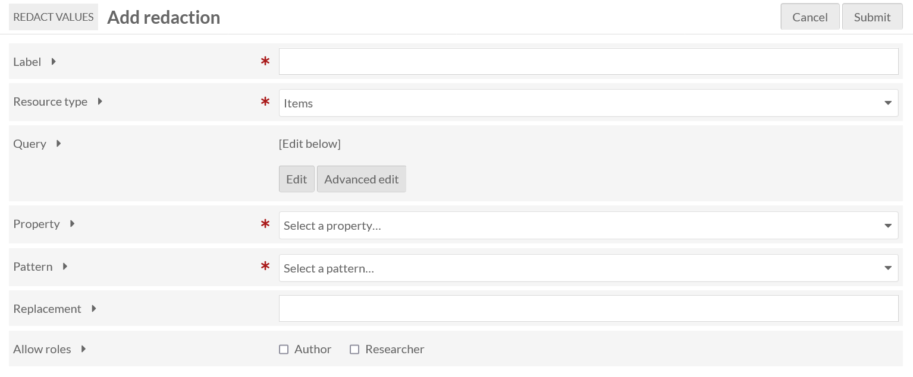
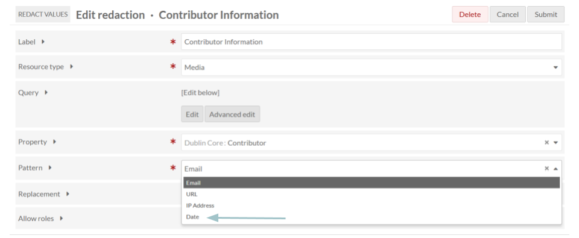

# Redact Values

The Redact Values module allows administrators to redact property values. Administrators will be able to choose a resource type, build a query to filter the resources, select the property from which to redact text, select the pattern to use for redaction, enter the replacement text, and choose what lower roles will be allowed to view redacted text.

To install Redact Values follow the instructions for Installing Modules on the Modules documentation.

## Adding a Redaction

Select Redact Values from the Modules tab of the left-hand navigation. Click the "Add Redaction" button in the upper right corner.

When adding a redaction, you are required to provide:
1. A **label** for your redaction;
2. The **resource type** you would like to redact (item, item set, or media);
3. The **property** from which to redact text; and,
4. The **pattern** to use when redacting text.

If you'd like, you can also add a query to filter the resources from which to redact text. You can add a query via the "Edit" button, which will open a drawer on the right that provides options for narrowing your search. Alternatively, you can use "Advanced Edit" to add your query directly from the search results page by copying everything in your browser's address bar starting with the question mark all the way to the end of the search url (to the right). In either circumstance, be sure to click the "Apply" button to add your query to the form. No query means all resources of the specified resource type will be included in your redaction. 

There is also a field to include the replacement text that will appear in place of the redacted values. If you leave this blank, the redacted field will not be visible to roles who do not have permission to view redactions.

You also have the option to give certain role types permissions in viewing redactions. Note that any user with permission to update a resource can automatically view its redacted text. You can allow Authors or Researchers by checking their respective boxes.

Be sure to click "Submit" in the upper right corner to save your changes.

## Managing Redactions

You can manage your already created redactions from the main module screen. To edit a previously added redaction, click the "Edit" icon next to the redaction you would like to change. 

Be sure to submit the form again after you have made any changes. 

You can also sort your existing redactions by date or label in ascending or descending order via the "Sort" function in the upper right corner.

## Adding Patterns

You can customize the patterns available for redactions by selecting "Patterns" under Redact Values in the Modules tab of the left-hand navigation. To create a new pattern, select the "Add Pattern" button in the upper right corner. You will be asked to provide both a **Label** and a **Pattern**.

For the pattern, you must enter the regular expression pattern that identifies the sequence of characters that will be redacted. You must enclose the pattern with [delimiters](https://www.php.net/manual/en/regexp.reference.delimiters.php). You may use [modifiers](https://www.php.net/manual/en/reference.pcre.pattern.modifiers.php). For more information on regular expressions, see [Regular-Expressions.info](https://www.regular-expressions.info/) and [PCRE Patterns](https://www.php.net/manual/en/pcre.pattern.php). To validate your pattern, try [RegExr](https://regexr.com/).

Once you have added this information, click "Submit" in the upper right corner. Your added pattern should now appear in the Pattern dropdown menu when adding a redaction.

