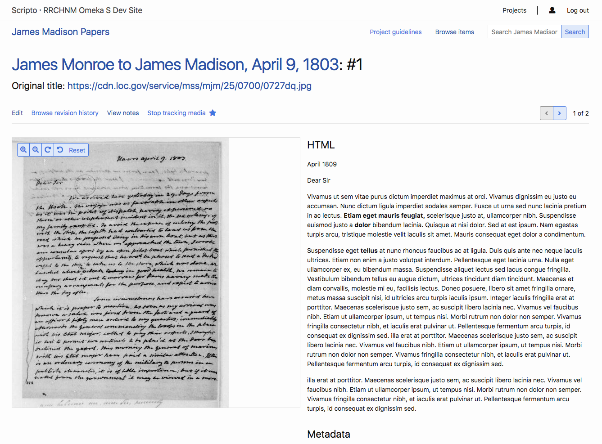

On the public side, users can browse the Scripto project but in order to edit or create content they must have a Scripto (Mediawiki) account and be logged in. 

## Public project view
On the public side, projects display a progress bar for all items, so that community users can easily identify media or items to work on. 

## Public item view
The public item view displays the Omeka S item metadata in a column on the left side, and the media in the main area on the right. 

Users can toggle between gallery and list views using the layout button. They can also *sort* and *filter* media in the item. Sort options are by last edited, last completed, and last approved. Filter options are is edited, is not edited, is completed, is not completed, is approved, is not approved.

Users can either click on the media's index number to view media information, on edit to go straight to the mediawiki transcription/translation interface.

## Public media view
The initial media view shows the media on the right, with metadata on the left. Underneath the media display is the HTML of whatever wikitext has already been generated. 

At the top of the page is the title of the item, which functions as a link back to the item, followed by the media's number (the second page will be #2, for example). Below this information is the original title of the media itself. 

On the left above the media and metadata are a series of buttons:

- *Edit*
- *Browse revision history*
- *View notes*
- And *track/stop tracking media* with a star button which toggles this option.

On the right above the media and metadata is a pagination button which allows users to easily move between media for a single item

### Adding text
To start working with a piece of media, the user clicks "edit" in the toolbar above the media and metadata display.

A new page loads, with a media viewer and a editing workspace for users to enter text. Depending on the selected layout, media may be to the right of the workspace or above it.

The area between the media title and the workspace and viewer has a combination of information display and action items for the user. 

On the far left is a button to track or stop tracking media, with a star icon.

In the center is an information display with the media's Protection, protection expiration, and status, and a checkbox where the user can mark the media as completed. 

On the far right are buttons to *save* or *cancel* changes. 

Users can rotate the media and zoom in and out using the controls within the media viewer. They can use the layout buttons to toggle between side by side and top and bottom views. 

Just above the mediawiki workspace is a field where users are encouraged to summarize their changes. 

The editing workspace has a formatting toolbar which adds MediaWiki markup to the text (it does not change the appearance of the text in the workspace). Any formatting will be applied to the HTML view of the text after changes are saved.