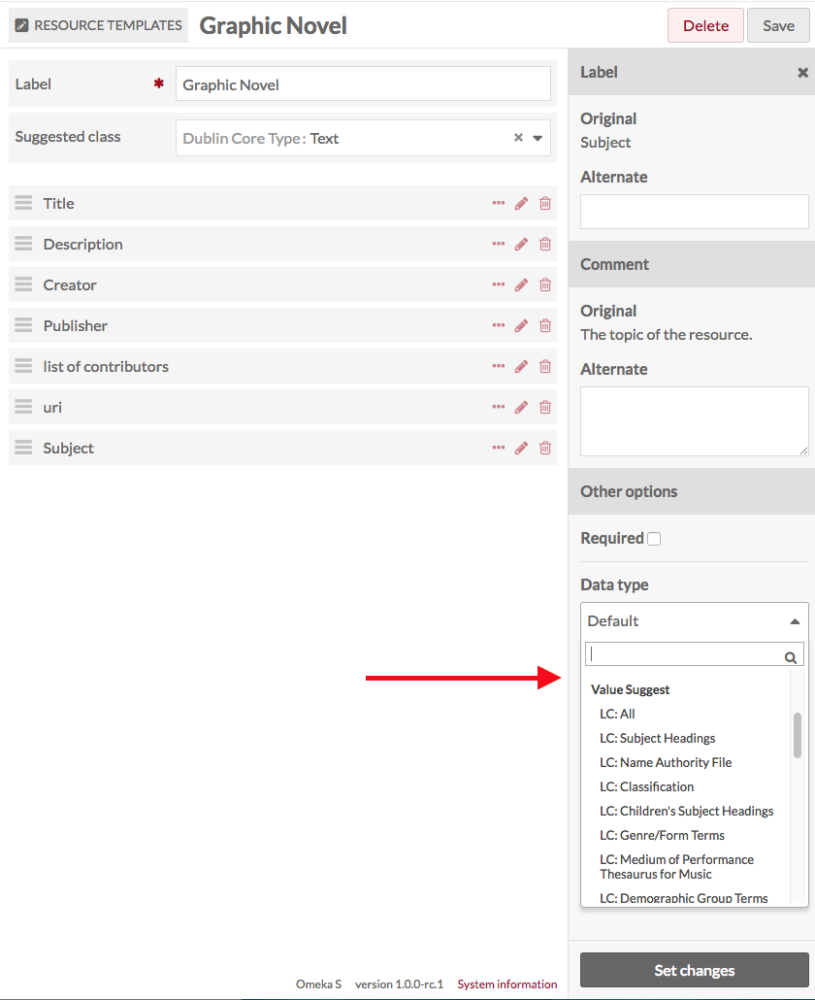

The ValueSuggest module adds an auto-complete feature to a specific property in a resource template and draws on controlled vocabularies (see the end of this page for a complete list).

This functionality helps those building an Omeka site to encourage consistent metadata input and data compatibility with other databases of records. Please note that ValueSuggest offers  but cannot require that users select values from the autosuggest feature. Users will always have the option of creating their own value instead.

To install ValueSuggest follow the instructions for Installing Modules on the Modules documentation.

Create a Resource Template
--------------------
ValueSuggest vocabularies are applied through Resource Templates. For additional information on Resource Templates, see the [Resource Template Documentation](../content/resource-template.md).

1. From the Resources templates tab in the Admin Dashboard, either add a new [template](../content/resource-template.md) or edit an existing one.
2. Add the property to which you want to apply the ValueSuggest. 
3. Once the property is added to the template, click the pencil/edit icon for that property.
4. At the bottom of the drawer which opens on the right, open the *Data type* dropdown. Below the standard options, you will see the ValueSuggest options. Select the vocabulary you want to use from the dropdown.
	- Note that you can also add alternate labels and comments for the property in this drawer.
6. Click the *Set changes* button at the bottom of the drawer to assign the Values to the property. 
7. Save changes to the resource template. 

When you click the title of a Resource Template to see its details, the ValueSuggest vocabulary will appear under the Data Type table heading.

Adding ValueSuggest to an Item
--------------------
When this Resource Template is used in an Item or Item Set, the designated properties will auto-suggest values from the vocabulary specified in the template. 

Users must start typing in the open text box of that specific property to prompt the auto-suggest feature. There may be a slight delay, but a drop-down menu will appear with choices drawn directly from the authority or vocabulary list you have associated with that property.

Hover over selections in the dropdown menu for a description of that vocabulary.

Note: after selecting a value, a box containing a URL should appear under the value. This link will direct visitors to a webpage with additional information on the value selected. This box can be removed by clicking the “X”.

Available Vocabularies
-------------------------------------
This module includes the following vocabularies:

- GeoNames
- The Getty Vocabularies
- Homosaurus
- Library of Congress Linked Data Service
- OCLC Metadata Services
- PACTOLS of Frantiq
- PeriodO
- RDA Value Vocabularies
- Tesauros del patrimonio cultural de España
- UNESCO

### [GeoNames](http://www.geonames.org/)

- The GeoNames geographical database

### [The Getty Vocabularies](http://vocab.getty.edu/)

- The Art & Architecture Thesaurus (AAT)
- The Getty Thesaurus of Geographic Names (TGN)
- The Union List of Artist Names (ULAN)

### [Homosaurus](http://homosaurus.org/)

- Homosaurus.org linked data vocabulary

### [Library of Congress Linked Data Service](http://id.loc.gov/)

- AFS Ethnographic Thesaurus
- All
- Children's Subject Heading
- Classification
- Cultural Heritage Organizations
- Demographic Group Terms
- Genre/Form Terms
- ISO639-1 Languages
- ISO639-2 Languages
- ISO639-5 Languages
- MARC Countries
- MARC Geographic Areas
- MARC Languages
- MARC Relators
- Medium of Performance Thesaurus for Music
- Name Authority File
- Subject Headings
- Thesaurus for Graphic Materials

### [OCLC Metadata Services](https://www.oclc.org/en/services/a-z.html/:F2664:/)

- Faceted Application of Subject Terminologies (FAST)
- The Virtual International Authority File (VIAF)

### [PACTOLS of Frantiq](https://pactols.frantiq.fr/)

- The entire pactols thesaurus
- The subject group only

### [PeriodO](http://perio.do/en/)

- A gazetteer of period definitions for linking and visualizing data

### [RDA Value Vocabularies](http://www.rdaregistry.info/termList/)

#### RDA Reference value vocabularies

- Aspect Ratio Designation
- Bibliographic Format
- Broadcast Standard
- Carrier Extent Unit
- Carrier Type
- Cartographic Data Type
- Colour Content
- Configuration of Playback Channels
- Content Type
- Conventional Collective Title
- File Type
- Font Size
- Form of Musical Notation
- Form of Notated Movement
- Form of Tactile Notation
- Format of Notated Music
- Frequency
- Generation
- Groove Pitch of an Analog Cylinder
- Groove Width of an Analog Disc
- Illustrative Content
- Layout
- Material
- Media Type
- Mode of Issuance
- Polarity
- Presentation Format
- Production Method
- Recording Medium
- Reduction Ratio Designation
- Regional Encoding
- Scale Designation
- Sound Content
- Special Playback Characteristics
- Status of Identification
- Terms
- Track Configuration
- Type of Recording
- Video Format

#### RDA Local value vocabularies

- Gender

#### RDA/ONIX Framework value vocabularies

- Character
- Extension Mode
- Extension Requirement
- Extension Termination
- Housing Format
- Image Dimensionality
- Image Movement
- Interaction
- Intermediation Tool
- Revision Mode
- Revision Requirement
- Revision Termination
- Sensory Mode
- Storage Medium Format

### [Tesauros del patrimonio cultural de España](http://tesauros.mecd.es/tesauros)

- Diccionario de Bienes Culturales
- Diccionario de Materias
- Diccionario de Técnicas
- Diccionario de Contextos Culturales
- Diccionario Geográfico
- Diccionario de Toponimia Histórica
- Diccionario de Cerámica
- Diccionario de Numismática
- Diccionario de Mobiliario

### [UNESCO](http://skos.um.es/)

- Tesauro
- Nomenclatura de Ciencia y Tecnología
- Biblioteca Digital Floridablanca
