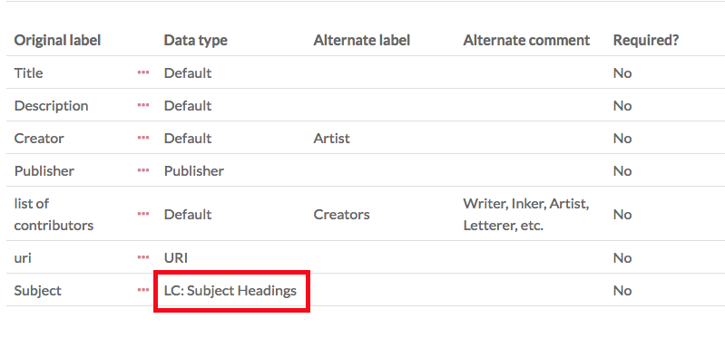
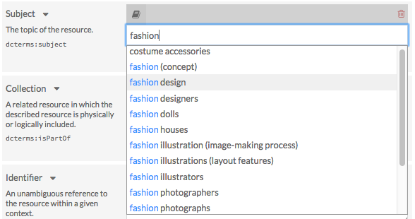

The ValueSuggest module adds an auto-complete feature to a specific property in a resource template and draws on controlled vocabularies from Library of Congress and Getty Collection.

This functionality helps those building an Omeka site to encourage consistent metadata input and data compatibility with other databases of records. Please note that ValueSuggest offers  but cannot require that users select values from the autosuggest feature. Users will always have the option of creating their own value instead.

To install ValueSuggest follow the instructions for Installing Modules on the Modules documentation.

Create a Resource Template
--------------------
ValueSuggest vocabularies are applied through Resource Templates. For additional information on Resource Templates, see the [Resource Template Documentation](../content/resource-template.md).

1. From the Resources templates tab in the Admin Dashboard, either add a new [template](../content/resource-template.md) or edit an existing one.
2. Add the property to which you want to apply the ValueSuggest. 
3. Once the property is added to the template, click the pencil/edit icon for that property.
4. At the bottom of the drawer which opens on the right, open the *Data type* dropdown. Below the standard options, you will see the ValueSuggest options. Select the vocabulary you want to use from the dropdown.
	- Note that you can also add alternate labels and comments for the property in this drawer.
6. Click the *Set changes* button at the bottom of the drawer to assign the Values to the property. 
7. Save changes to the resource template. 

When you click the title of a Resource Template to see its details, the ValueSuggest vocabulary will appear under the Data Type table heading.

Adding ValueSuggest to an Item
--------------------
When this Resource Template is used in an Item or Item Set, the designated properties will auto-suggest vocabulary. Users must start typing in the open text box of that specific property to prompt the auto-suggest feature. There may be a slight delay, but a drop-down menu will appear with choices drawn directly from the authority or vocabulary list you have associated with that property.

Hover over selections in the dropdown menu for a description of that vocabulary.

Note: after selecting a Getty or LC property, a box containing a URL should appear under the value. This link will direct visitors to a webpage with additional information on the value selected. This box can be removed by clicking the “X”.

