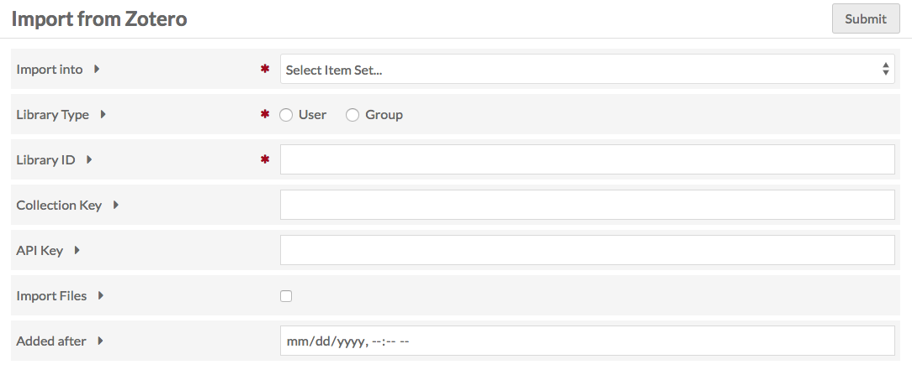

Zotero Import is a [module](index.md) for Omeka S which allows you to connect an Omeka S instance to a Zotero library and import items from that library.

To install Zotero Import, follow the instructions for [Installing Modules](index.md#installing-modules) on the Modules documentation.

## Prepare your Zotero Library
Ensure that your Zotero library is published. Login to Zotero, go to settings, and then to privacy. Make sure that 'publish entire library' is checked. The 'publish notes' box can also be checked.

In order to import from a Zotero library, you must have API access to the library. To use Zotero Import, you will need the ID for the group or user

  * Individual IDs are found on the Feeds/API tab of your Zotero Settings; there is a sentence stating “Your userID for use in API call is”.
  * Group IDs are found on the Zotero group library page by looking at the URL of “Subscribe to this feed” - it is numeric sequence following “api.zotero.org/groups/“.

You may also want to have the id for a specific collection and an API key to import files. 

* Collection keys appear in the url of a collection page - they are the alphanumeric sequence at the end of the url, following “collectionKey/“
* To generate an API key, go to Settings in your Zotero account, to the Feeds/API tab, and click the *Create new private key* link.

## Import Data

To import, go to the Zotero Import tab on the left-hand navigation of the admin dashboard of your Omeka S install. This will automatically take you to the Import sub-tab, also in the left-hand navigation.

To import from a Zotero library:

* Choose an Item Set for imported items (required); 
* Choose between *User* or *Group* libraries with the radio buttons (required); 
* Enter the user ID (required); 
* Enter a collection key (not required); 
* Enter your API key to import private data and/or files (optional for import but necessary to import files)
* Choose whether to import files. The API key is required to import files.
		* HTML page snapshots will be imported as zip files. 
*  Choose “Added After”. Only import items that have been added to Zotero after this datetime.
* Hit Submit.

A note on files: The rules for importing an item are the same as creating an item in Omeka, so if your Zotero library has files which are a disallowed media type, the items will not be imported.

The page will load on the Past Imports tab with a message "Importing from Zotero". To check the status of the import, reload the page or click to the [Jobs](../admin/jobs.md) tab of the left-hand navigation on the admin dashboard.

Managing Past Imports
---------------------------------
To view and manage past imports, click on the Zotero Import tab in the left-hand navigation, and then click on the "Past Imports" sub-tab.

The Past Imports shows a table of previous imports, whether successful, failed on error, or undone. The table has the following columns:

- *Zotero Library* giving the User or Group library name;
- The *Undo* button, which is a counter-clockwise curved arrow;
- *Items Added Before* the date of the import;
- *Job Status* current status of job. Clicking on the text of a job status will take you to that job's page;
- *Item count* the number of items added in the import.

To Undo an import, click the *Undo* button to the left of the *Items Added Before* timestamp. This will open a sidebar dialog asking you to confirm that you want to undo the import and delete all imported items. Click *Confirm* to continue. 

Past Imports which have already been undone will have a job status "Undo Import Completed".
