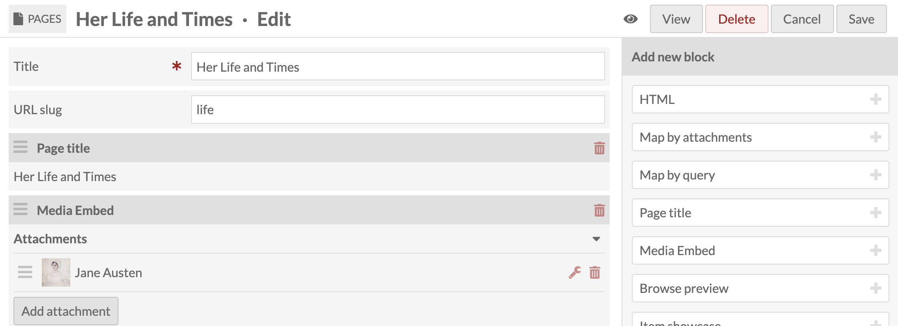
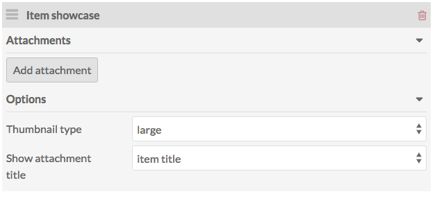

Pages form the content of your [sites](../sites/index.md). A site can have a single page or many pages.

Manage the pages for a site by navigating to the Sites tab on the left-hand navigation of the admin dashboard. Select the site  for which you want to manage the pages and click either the title or the edit (pencil) button to edit that site. 

Once you are editing the site, click the Pages tab in the left hand navigation.

When you create a new site, Omeka S automatically adds a page titled *Welcome* with a single HTML block (see below). You can edit this page or delete it.

## Adding Pages
From the page for the site, click the Pages tab. Then click the *Add new page* button on the upper left side of the window.

  

To add a page you must enter a *Title*. You can also enter a *URL Slug*. Both of these can be edited later but are required to create the page. If you do not enter a slug, Omeka S will create one from the page title. A slug is the page’s portion of the url and can only contain letters, numbers, and hyphens; no other characters are allowed.

To add a page you must enter a *Title*. You can also enter a *URL Slug*. Both of these can be edited later but are required to create the page. If you do not enter a slug, Omeka S will create one from the page title. A slug is the page’s portion of the url and can only contain letters, numbers, and hyphens; no other characters are allowed.

Once you have entered this information, click the Add button in the upper right hand corner of the browser window.

## Editing Pages  
After clicking the Pages tab, select the page you wish to edit by clicking the name of the page or the edit button (pencil). Note: clicking on the Page *title* will take you to the public view of that page. On the right hand side you can choose to add a new block by selecting one of the following layouts: 
- HTML
- Page Title
- Media
- Browse Preview
- Item Showcase
- Table of Contents
- Line Break
- Item with Metadata

If you have the relevant modules installed, you may also have:
- Map
- Collecting

Once you have added blocks to your page, click the Save button in the right hand corner. 

You can delete any of the blocks by clicking on the trash can icon located in the upper right corner of the block. 

Change the order of blocks by clicking on the three horizontal lines on the upper left corner of the block and then dragging and dropping it to the desired location.

Some modules may create additional blocks for your site pages. For information on working with these blocks, please see the documentation for that [module](../modules/index.md)
## Page Blocks
Pages are made up of blocks, each of which has a different form of content.

### HTML
Creates an HTML box in which you can add formatted text and links. When you click in the box, a formatting menu will display above the text field. 

Basic block: 

With formatting menu open:

### Page Title
Displays the title of the current page.

### Media
Creates a block with one or more pieces of media associated with items in the item pool. 

To add media, click the *add attachment*. 
On loading, the drawer will show a list of your items, most recent first. You can select form the first page, page through using the forward and back arrows, or search using the search bar.

Once you’ve selected an item, the drawer will shift to that item’s information. You can add a caption and select which media (if more than one) you want to use. To return to the list of items, click the *Select item* button at the top of the drawer. To use the item displayed and apply the caption, etc, click the *Apply changes* button at the bottom of the drawer.

The Media block has options for the display of the media: 

- Thumbnail type: choose from large, medium, and square.
- Thumbnail alignment: relative to page. Choose from left and right.
- Show attachment title: Choose whether the media should have a caption of the item title, file name, or no title displayed at all.

*Layout note*: If you want media to appear beside a block of text, place a media block *above* an HTML block.

### Browse Preview

Allows you to add a block of items on a site page.

In order to create a Browse Preview block, you'll first need to perform a search on your Omeka S installation for the items you want to include. You can use the general search on the left hand navigation or, if you want to show all items in an item set, use the Advanced Search from Items browse. NB: if you leave the search options blank, the browse preview will load all items in your site's item pool.

Once you have searched, highlight everything in your browser's address bar starting with the question mark all the way to the end of the search url (to the right).

 

In the *Query* field of the Browse Preview block, paste the part of the url you just copied (everything from the question mark over). 

The *Preview Title* field sets the heading above the browse section on the page.

The *Browse link text* field sets the link text at the bottom of the block - the block will only display the first ten results for the query.

### Item Showcase
A list of items. 

Using the drop-down menu in the block, you can set the thumbnail size for these items as large (default), medium, or square. 

Click the *Add Attachment* button to add an item to the block. This will open a drawer on the right side of the page to browse and select items.

On loading, the drawer will show a list of your items, most recent first. You can select form the first page, page through using the forward and back arrows, or search using the search bar.

Once you’ve selected an item, the drawer will shift to that item’s information. You can add a caption and select which media (if more than one) you want to use. To return to the list of items, click the *Select item* button at the top of the drawer. To use the item displayed and apply the caption, etc, click the *Apply changes* button at the bottom of the drawer.

To cancel the item selection, click the X in the upper right corner of the drawer at any time.

Once you’ve added an item, it will appear in the Item List block. You can edit the caption or media options by clicking the edit (wrench) button for that row, and you can delete the item using the delete (trash can) icon.

You can add multiple items to the list.

### Table of Contents
If the current page has child pages, you can add a table of content block for those pages.

The Depth option allows you to set how many levels of child pages you want to display. If left blank, it will display all possible levels. Please enter a whole number.  

Add and arrange pages using the [Site Navigation](../sites/site_navigation.md) settings. 

### Line Break
Line break creates a transparent or opaque line break on the page, clearing all blocks. Select whether the line is transparent or opaque from the dropdown.

HTML blocks wrap around Media blocks and at times you may want to clear the page. You might also want to create a visual break on the page. 

### Item with Metadata
This block displays an item along with all associated metadata (entered when creating or editing the [item](../content/items.md)).

Add attachments in the same manner as the [media](../sites/site_pages/#media) page block.

### Other blocks
For module-specific blocks (like [Collecting](../modules/collecting.md) or [Map](../modules/mapping.md)) see the documentation for that module.

## Deleting Pages
To delete a page, go the to *Pages* tab of the site of which the page is a part. Click the delete (trash can) button at the right end of the row for that page. 

A drawer will open on the right side of the page asking you to confirm that you wish to delete the page, with the name of the page displayed under the confirm button. To proceed, click the *Confirm delete* button. Otherwise, click the *X* in the upper right corner of the drawer to cancel.

