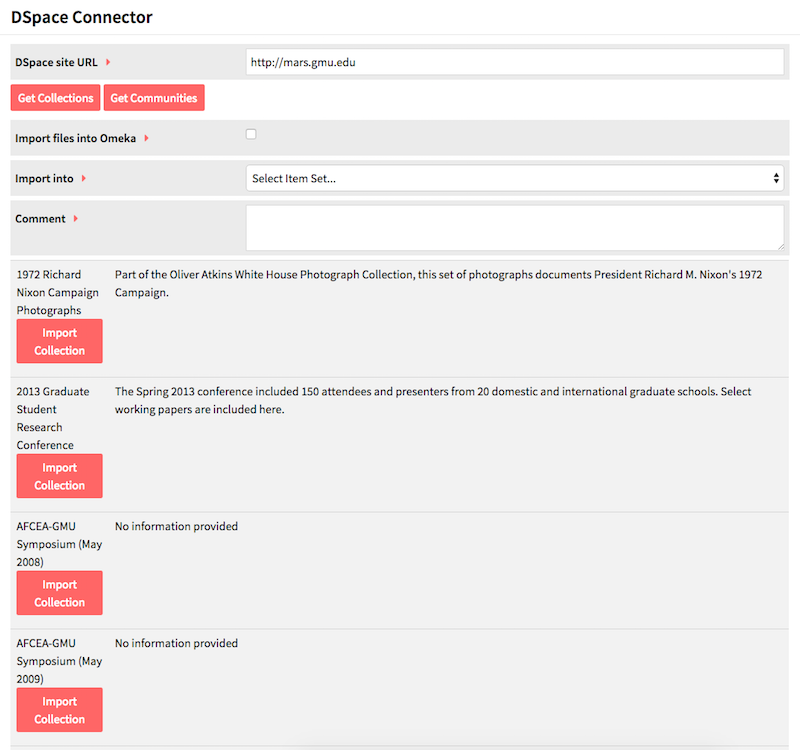

DSpace Connector is a [module](modules/modules.md) for Omeka S which allows you to connect an Omeka S instance to a DSpace repository to import items from that repository. In addition to importing information, the Omeka S item will include a link back to the original item.

To install DSpace Connector, follow the instructions for [Installing Modules](../modules/modules.md#installing-modules) on the Modules documentation.

Note that DSpace Connector only works with DSpace versions 4 and higher.

You can view past imports by going to the DSpace Connector tab on the left-hand navigation of the admin dashboard and clicking the *Past Imports* sub-tab.

## Import Data
To use DSpace Connector, navigate to the tab labelled *DSpace Connector* on the left-hand navigation of the admin dashboard. This will automatically take you to the Import sub-tab.

You should see a screen with the following options:

* *DSPace site URL* for the Repository (required);
* Button options to *Get Collections* or *Get Communities*
* *Import files into Omeka* checkbox, check yes if you want to import media and other files attached to content (optional, recommended);
* *Import into* a selected [Item Set](../content/item-sets.md), if desired (optional). 
 * Note that the Item Set must already exist in order to import into it.
* *Comment* for example, any notes to yourself or other users of the installation (optional);

To import from a DSpace Repository:
 1.  Enter a URL into the *DSpace site URL* field and then click either *Get Collections* or *Get Communities*, depending on your preference. Note that you have to enter the entire url, including the “http://“. This will load the collections or communities below the other options. 
1. If you want to import files as well as data, check the *Import files into Omeka* box.
1. If desired, select an [Item Set](../content/item-sets.md) to which you want the imported items to be added.
1. Add any comments.
1. Click the *Import Collection* button for the collection you want to import.

You can track the status of the import by navigating to the DSpace Connector > Past Imports tab or on the [Jobs](../jobs.md) tab of the left-hand navigation on the admin dashboard.

## Review Imports
Go to the DSpace Connector tab on the left-hand navigation of the admin dashboard, click on DSpace Connector and then click on Past Imports, which should appear below the DSpace Connector tab.

This page displays a table of Past DSpace Imports, with a checkbox option to *Undo*, the *Job ID* for the import, the repository’s *Dspace Collection Link*, any *Comments* made during import, the number of *Items* imported, the *Date* of the import, the import *Status*, and the *Owner*, or user who initiated the import.

## Undo an Import
To undo a completed import and remove all associated items, go to the DSpace Connector tab on the left-hand navigation of the admin dashboard, click on DSpace Connector and then click on Past Imports, which should appear below the DSpace Connector tab.

You will see a table of all post imports.

Check the box for each import you wish to undo and click submit.

