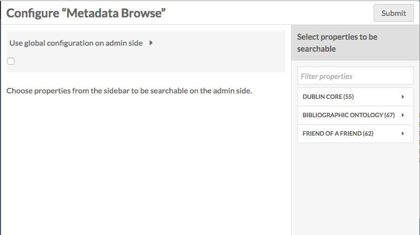
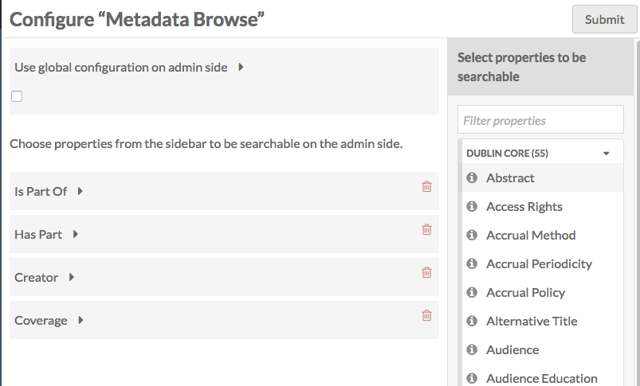

The Metadata Browse module makes it possible to browse all resources that share a value for a particular metadata property. 

The browse works on the admin side and can also be enabled on the public view of sites, on a site-by-site basis. 

Configuring (Global Settings)
-----------------
Once you have installed and activated the module, you can configure it from the Modules tab of the left-hand navigation. Click the Configure button, with the wrench icon, to the right of the Metadata Browse label. 

There are two configuration settings: the option for global configuration settings on the admin side, and selecting properties to be applied on the admin side.

### Global Configuration checkbox
The prompt for the checkbox states "If checked, the properties set below will be made links on the admin side. Otherwise, all properties made links in all sites will be links on the admin side."

When the box is *unchecked*, metadata browse on the admin side (and only the admin side) aggregates the metadata browse settings for all individual sites and applies them to every item and item set in the installation. 

Leaving the box unchecked allows installation users to browse the properties on the admin side which they have set as key on their sites. For example, a site about various artists might have the Metadata Browse enabled for 'Creator' (Dublin Core), while a site collecting conference papers might enable Metadata Browse for 'presented at' (Bibliographic Ontology); with the box unchecked, both 'Creator' and 'presented at' would have Metadata Browse enabled on the admin views of all items and item sets on the installation.

When the box is *checked*, individual site settings still apply on the public views of those sites, but are not used on the admin side. Instead, only those properties selected in the Metadata Browse module configuration settings (the current page) are used on the admin side.

Checking the box can be used to limit the number of properties which have Metadata Browse enabled on the admin side. If, for example, the site about various artists mentioned above was using Metadata Browse on every possible property, those Metadata Browse links would still be visible on their site, but would not show up on the admin side. Instead, the Global Administrator(s) could decided which properties to enable browsing on for the admin side, thus reducing visual clutter. 

### Choose properties
Selecting properties for Metadata Browse in the Module configuration will only work if the *use global configuration*  checkbox is checked. 

Select the properties from the sidebar by clicking on the desired property. It will load under the prompt "Choose properties".

To remove a property simply click the trash can/delete icon to the right of the property label.

Metadata Browse on Sites
------------------------------
Once the module is activated and installed 

Admin side browse
-------------------