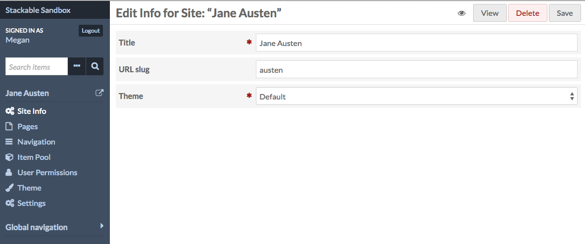

Sites are the public-facing side of an Omeka-S installation. With sites you can create content and interpretation around a group of items from your installation. 

Sites are managed and access via the *Sites* tab on the left-hand side of the administrative dashboard. 

The manage sites page displays a table with all the sites for the installation, giving the title and owner for each site. Either of these columns can be used to sort the list of sites by using the up and down arrows on the right edge of the column heading.

Each row gives the title of a site, options to *edit* (pencil) or *delete* (trash can), and the owner of the site. *Only global admins and site owners can delete a site.*

Clicking on the site title will take you to the site’s admin show page. 

## Adding a site
To create a site, click the *Add new site* button in the upper right-hand corner of the page. 

You will need to:
* create a *slug* for the site’s url. The url will be *installurl/site/slug*
* Give your site a *title*
* Select which *theme* you want for the site or whether to go with the installation default. Themes set the appearance of the site.

In the upper right hand corner of the screen, next to the *Add* button, you can set the visibility of your site using the the *make public/private* button (eye icon).

 Public 

  Private

You will probably want to leave the site Private until you have added some content.

## Manage a site
On the admin show page for a site, you can see the URL Slug, Title, and current Theme for the site. 

On the left-hand navigation are options for site *settings* and site *pages*. Settings include: administrative options, the item pool, navigation management, and user permissions. 

The standard options in the left hand navigation (items, item sets, etc) are still available under the *Global Navigation* header. Click the orange arrow to reveal those menu options.

## Site Settings. 
Site settings have the following tabs: Admin, Item Pool, [Navigation](../sites/site_navigation.md), and User Permissions. 

On the *Admin* tab on the edit site page, you can change the site’s *URL Slug*, *Title*, and *Theme*

See below for information on using. *Item Pool* and *User Permissions* 

From any tab you can use the the *make public/private* button (eye icon) to set whether the site is visible to the public or only to users of the Omeka S system. 

 Public 

  Private

### Managing the Item Pool
The Item Pool determines what automatically appears in the item selection options on a site’s pages. It also creates the items which may appear on a browse page on your site.

Note that the search options for the Item Pool build on each other. Every search you add further narrows what is returned for the pool.

The settings in the Item Pool tab allow you to set the parameters for the pool. You can use one or more of the search options:
* *Search by class*: search by resource Class. 
* *Search all properties*: create a search across all properties in all items. You can use the drop-down menu to select from: has exact value, does not have exact value, contains value, or does not contain value. Use the *Add new value* to create additional search criteria.
* *Search specific property*: search for words or phrases within a specific property. Select the property from the drop down menu, and then select from: as exact value, does not have exact value, contains value, or does not contain value. Use the *Add new value* to create additional search criteria.
* *Search resources*: search for resources which either *has property* or *does not have propert* for a specific resource class.
* *Search by item set*: include all items within a specific item set.

### Managing User Permissions
To add a user to a site, navigate to the *User permissions* tab (see above).

On the right hand side of the screen a drawer will appear that shows all of the users for your install, sorted by the first letter of their first name. To add a user, click on their name. You will then be prompted to check various boxes:

Viewer: user can see the site’s backend but cannot edit.
Editor: user can access and edit the site’s backed.
Admin: user has full administrative privileges for the site, including adding users and deleting the site.

Once you've added one or more users, click the Save button located in the upper right hand corner. You can add or revoke privileges for users by going back to the User permissions tab and selecting or deselecting the boxes and clicking Save. Users can be deleted from the site by clicking the trash can icon located next to the Edit box.

### See also
- [Site Navigation](../sites/site_navigation.md)
- [Site Pages](../sites/site_pages.md)