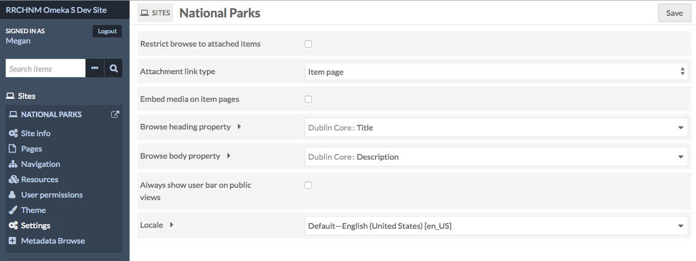

Sites are the public-facing side of an Omeka-S installation. With sites you can create content and interpretation around a group of items from your installation. 

Sites are managed and access via the *Sites* tab on the left-hand side of the administrative dashboard. 

The manage sites page displays a table with all the sites for the installation, giving the title and owner for each site. Either of these columns can be used to sort the list of sites by using the up and down arrows on the right edge of the column heading.

Each row gives the title of a site, options to *view* (box with outward arrow), *edit* (pencil), or *delete* (trash can), and displays the owner of the site. *Only global admins and site owners can delete a site.*

Clicking on the site title will take you to a summary page for the site which displays the site’s *url slug, title,* and *theme*. , from which you can return to the site list using a button on the left side of the scree, or *edit* or *view* the site using buttons in the upper right 

## Adding a site
To create a site, click the *Add new site* button in the upper right-hand corner of the site browse page.

You will need to:
* Give your site a *title* (required)
* create a *slug* for the site’s url. The url will be *installurl/site/slug*. This is optional - if you leave this field blank, Omeka S will create a slug based on the site title.
* Select which *theme* you want for the site or whether to go with the installation default. Themes set the appearance of the site. (required)

In the upper right hand corner of the screen, next to the *Add* button, you can set the visibility of your site using the the *make public/private* button (eye icon).

 Public 

  Private

You will probably want to leave the site Private until you have added some content.

You can set up the [item pool](../sites/site_itempool.md) at this point, or after the site has been created.

When you are ready, click the *Add* button in the upper right corner. Once the page is created, you will be redirected to the site info tab of the site management. 

## Manage a site
To manage a site, navigate to the *Sites* tab from the Omeka S Admin Dashboard. Click either on the site’s title or the edit (pencil) button in the list of sites. 
 
The admin show page for a site, you can see the URL Slug, Title, and current Theme for the site. 

Site admin left hand navigation options are: 
- *Site Info*, (see below)
- *[Pages](../sites/site_pages.md)*, 
- *[Navigation](../sites/site_navigation.md)*, 
- *[Item Pool](../sites/site_itempool.md)*,
- *User Permissions*, (see below)
- *Theme* (see below)
- *Settings*. (see below)

The standard options in the left hand navigation of the Omeka S Admin (items, item sets, etc) are still available under the *Global Navigation* header. Click the words *Global Navigation* or the small orange arrow to reveal the standard left-hand navigation menu options.

## Site Info 
The site info settings for an Omeka S site are where you can change the *URL slug*, site *Title*, and *theme*. 

From this tab you can use the the *make public/private* button (eye icon) to set whether the site is visible to the public or only to users of the Omeka S system. 

 Public 

  Private

## See also: 
* [Site Pages](../sites/site_pages.md)
* [Site Navigation](../sites/site_navigation.md)
* [Site Item Pool](../sites/site_pages.md)

## Managing User Permissions
To add a user to a site, navigate to the *User Permissions* tab.

A drawer on the right hand side of the screen shows all of the users for your install, sorted by the first letter of their first name. 

To add a user, click on their name. 

Then select their role from the dropdown:
*Viewer*: user can see the site’s backend but cannot edit.
*Editor*: user can access and edit the site’s backed.
*Admin*: user has full administrative privileges for the site, including adding users and deleting the site.

Once you've added one or more users, click the Save button located in the upper right hand corner. You can add or revoke privileges for users by going back to the User permissions tab and selecting or deselecting the boxes and clicking Save. Users can be deleted from the site by clicking the trash can icon on their row.

## Theme
This tab allows you to customize theme settings for the site.

The setting *Top Navigation Depth* allows you the limit the depth of the top navigation menu on the public side of the site.  The default setting, 0, does not restrict the number of levels of the top navigation menu. Setting it to one would only show the top-level pages or links of your site.

## Settings
There is a check box to *Restrict browse to attached items*. If checked, users adding content to sites pages will only be able to access items designated in the Item Pool, and the public browse page will be limited to that content as well.

